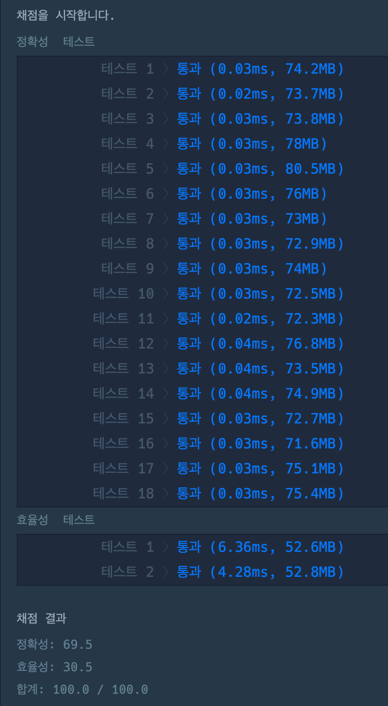
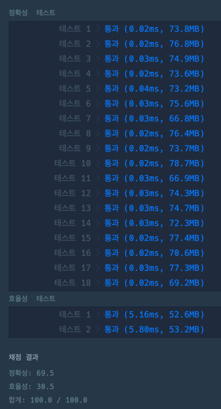
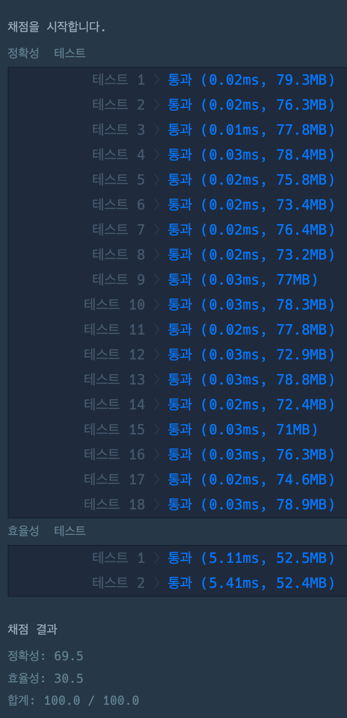
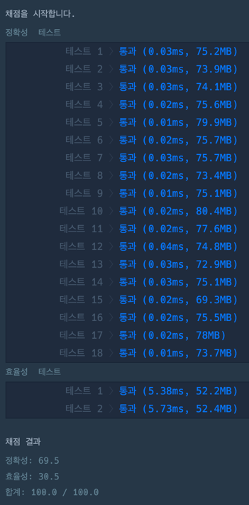
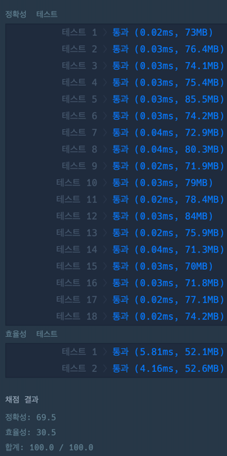

>
~~~java
class Solution {
    boolean solution(String s) {
        boolean answer = false;
        char[] chars = s.toCharArray();
        int count = 0;

        if ((chars[0] == '(' && chars[chars.length - 1] == ')')) {

            for (char c : chars) {
                count += (c == '(' ? 1 : -1);
                
                if (count < 0) return false;
            }
            
            answer = count == 0;
        }

        return answer;
    }
}
~~~
---
>
~~~java
class Solution {
    boolean solution(String s) {
        int count = 0 ;
        int length = s.length();

        if (s.charAt(0) != '(' || s.charAt(length - 1) != ')') {
            return false;
        }

        for (int i = 0; i < length; i++) {
            count += s.charAt(i) == '(' ? 1 : -1;

            if (count < 0) return false;
        }

        return count == 0;
    }
}
~~~
---
>
~~~java
class Solution {
    boolean solution(String s) {
        int count = 0 ;
        int length = s.length();
        
        if (s.charAt(0) != '(' || s.charAt(length - 1) != ')') {
            return false;    
        }

        for (int i = 0; i < length; i++) {
            count += s.charAt(i) == 40 ? 1 : -1;
            
            if (count < 0) return false;
        }

        return count == 0;
    }
}
~~~
---
>
~~~java
class Solution {
    boolean solution(String s) {
        int count = 0;
        int length = s.length();
        int cnt = 0;
        
        if (s.charAt(0) != '(' || s.charAt(length - 1) != ')') {
            return false;    
        }

        for (int i = 0; i < length; i++) {
            cnt += s.charAt(i) - 40;
            
            if (i + 1 < 2 * cnt) return false;
            
            count += 40;
        }
        
        return count == 80 * cnt;
    }
}
~~~
---
> 
~~~java
class Solution {
    boolean solution(String s) {
        float count = 0 ;
        int length = s.length();
        
        if (s.charAt(0) != '(' || s.charAt(length - 1) != ')') {
            return false;    
        }

        for (int i = 0; i < length; i++) {
            count += 40.5 - s.charAt(i);
            
            if (count < 0) return false;
        }

        return count == 0;
    }
}
~~~