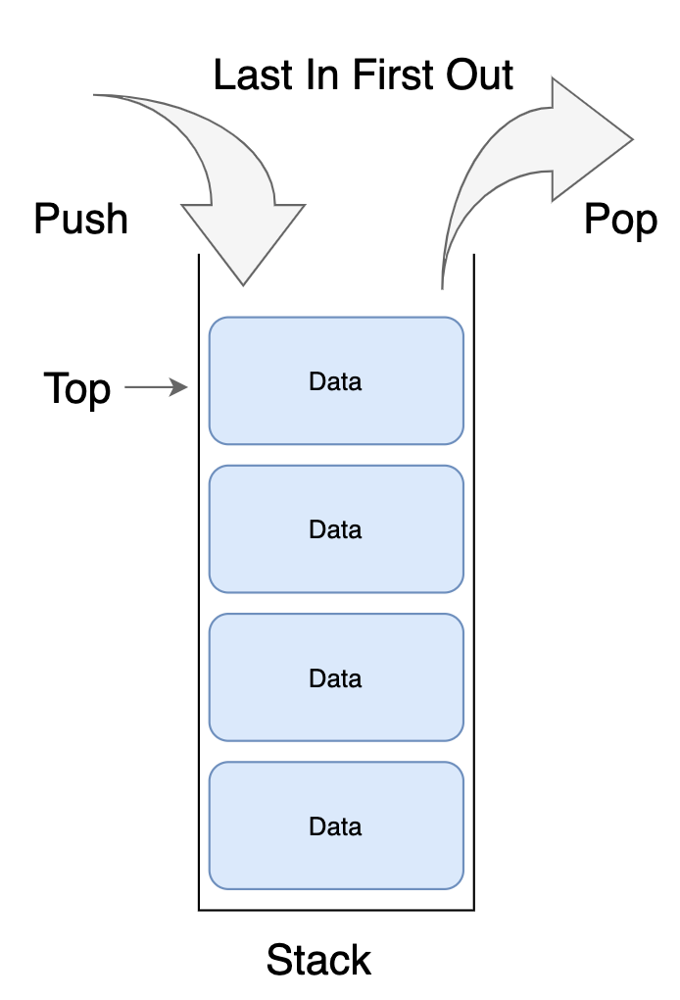

# Stack 자료구조
  
## Stack 이란?
후입선출(LIFO, Last In First Out) 방식으로 데이터를 저장하는 자료구조 이다.  

## Stack 자료구조의 구성함수  
* isEmpty()
  * 스택이 비어있는지 확인한다.
* isFull()
  * 스택이 꽉 찼는지 확인한다. 링크드리스트 스택은 최대크기가 없으므로 필요없다.
* push()
  * 스택에 데이터를 넣는다.
* pop()
  * 스택에서 데이터를 꺼내며 데이터를 반환한다.
* peek()
  * 스택에서 최상단 데이터를 반환하나 데이터를 꺼내지는 않는다.

## Stack 자료구조의 활용
* 재귀 알고리즘
  * 컴퓨터는 실제로 함수를 실행할 때 마다 스택 구조에 함수를 실행한 위치를 기억해두고, 함수가 끝나면 pop을 하며 원래 함수로 돌아간다.
* undo 구현
  * 실행내역을 스택 구조에 저장하면 이전 실행내역을 pop하는 것으로 undo를 구현할 수 있다.
* 후위 표기법 계산
  * 스택 구조를 이용하여 수식의 후위 표기법 결과를 계산할 수 있다.