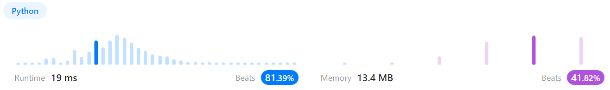
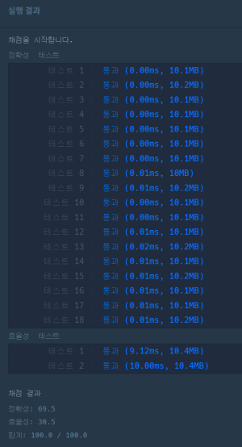

# 문제풀이
## 202. Happy Number

### Discription  
요약)  
해피넘버는 숫자의 각 자릿수의 제곱의 합을 구했을 때  
1이 나오지 않으면 다시 각 자릿수의 제곱의 합을 구하는 것을 반복하여 결과가 1이 나오는 수이다.  
입력한 숫자가 해피넘버인지 확인해보자.  
https://leetcode.com/problems/happy-number/

### Solution

```python
class Solution(object):
    def isHappy(self, n):
        count = {}
        sumN = 0
        while sumN != 1:
            sumN = 0
            while n // 10 != 0:
                sumN += (n % 10) ** 2
                n = n // 10
            sumN += n ** 2

            if count.get(sumN) == None:
                count[sumN] = True
                n = sumN
            else:
                return False
        
        return True
```
  
주어진 숫자의 각 자릿수의 제곱의 합을 구한 뒤 sum값이 map의 키로 존재하는지 확인한다.  
키가 존재하면 이미 한 번 나왔던 숫자이므로 무한반복되기 때문에 해피넘버가 아니다.  
키가 존재하지 않으면 map에 해당 값을 key로 삽입하고(값은 뭐든 상관없다) sum 값으로 다시 계산을 한다.  
만약 sum값이 1이라면 해피넘버이므로 종료한다.  

## 올바른 괄호

### 문제 설명
요약)  
괄호가 바르게 짝지어졌다는 것은 '(' 문자로 열렸으면 반드시 짝지어서 ')' 문자로 닫혀야 한다는 뜻입니다.  
문자열 s가 올바른 괄호이면 true를 return 하고, 올바르지 않은 괄호이면 false를 return 하는 solution 함수를 완성해 주세요.  
https://school.programmers.co.kr/learn/courses/30/lessons/42587  

### Solution

```python
def solution(s):
    answer = True
    stack = []
    
    for ss in s:
        if ss == "(":
            stack.append(ss)
        elif ss == ")":
            if len(stack) == 0:
                return False
            stack.pop()

    if len(stack) != 0:
        answer = False
        
    return answer
```
  
스택을 구현해놓은 뒤 '(' 문자를 만날 때마다 스택에 문자를 넣는다.  
')'문자를 만날 때마다 스택을 pop한다.  
pop하려는데 스택이 비어있거나, 문자열을 모두 순회했는데 스택이 비어있지 않으면 올바르지 않은 문자열이다.  
아니라면 올바른 문자열이다.  

