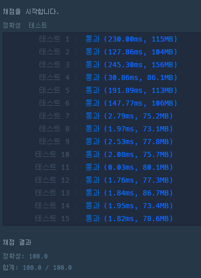

```java
import java.util.*;
class Solution {
    public String solution(int[] numbers) {
        boolean zero = true;
        String[] nums = new String[numbers.length];
        StringBuilder answer = new StringBuilder();
        
        for(int i=0; i<numbers.length; i++){
            if(numbers[i] != 0){ // 한번이라도 0이 아니라면
                zero = false;
                break;
            }
        }
        if(zero) return "0";

        for(int i=0; i<numbers.length; i++){
            nums[i] = String.valueOf(numbers[i]);
        }

        Arrays.sort(nums, new Comparator<String>() {
            @Override
            public int compare(String o1, String o2) {
                String str1 = o1+o2;
                String str2 = o2+o1;
                int int1 = Integer.parseInt(str1);
                int int2 = Integer.parseInt(str2);

                if(int1 > int2) return -1;
                else if(int1 == int2) return 0;
                else return 1;
            }
        });

        for(int i=0; i<numbers.length; i++){
            answer.append(nums[i]);
        }
        return answer.toString();
    }
}
```
Array정렬(Array.sort) 검색과 Comparator 검색

https://st-lab.tistory.com/243참고
