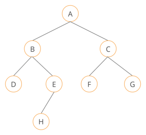
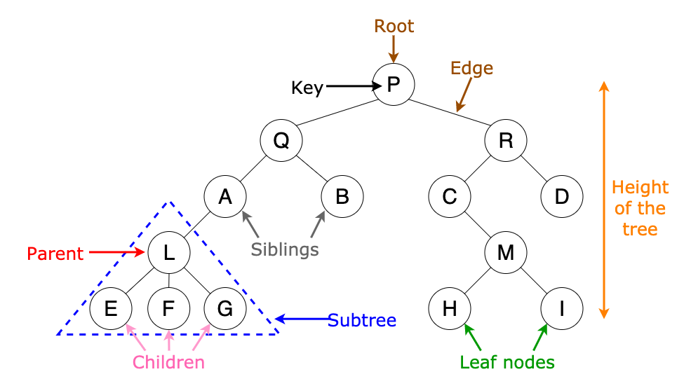
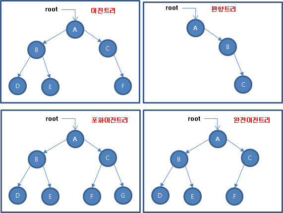
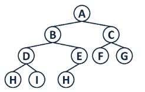
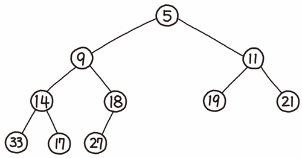
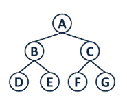
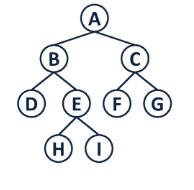
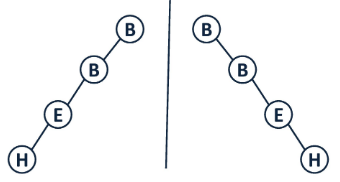

# 트리

### 트리란?
자료구조 Tree는 하나의 뿌리로부터 가지가 사방으로 뻗은 형태가 나무와 닮아서 트리 구조라고 부른다.\
자료구조 Tree는 그래프의 여러 구조 중 무방향 그래프의 한 구조이다.\
트리 구조는 데이터가 바로 아래에 있는 하나 이상의 데이터에 무방향으로 연결된 계층적 자료구조이다.\
트리 구조는 데이터를 순차적으로 나열시킨 선형 구조가 아니라,\
하나의 데이터 뒤에 여러 개의 데이터가 존재할 수 있는 비선형 구조이다.\
트리 구조는 계층적으로 표현이 되고, 아래로만 뻗어나가기 때문에 사이클이 없다.\
트리 구조는 루트라는 하나의 꼭짓점 데이터를 시작으로, 여러 개의 데이터를 간선으로 연결한다.\
트리 구조는 각 데이터를 노드라고 하며, 두 개의 노드가 상하계층으로 연결되면 부모/자식 관계를 가진다.\
트리 구조에서 자식이 없는 노드는 나무의 잎과 같다고 하여 리프 노드라고 부른다.\
자료구조 Tree는 깊이와 높이, 레벨 등을 측정할 수 있다.\

### 트리의 용어
노드(Node) - 노드란 트리 구조를 이루는 모든 개별 데이터\
루트(Root) - 루트란 트리 구조의 시작점이 되는 노드\
부모 노드(Parent node) - 부모 노드란 두 노드가 상하관계로 연결되어 있을 때, 상대적으로 루트에서 가까운 노드\
자식 노드(Child node) - 자식 노드란 두 노드가 상하관계로 연결되어 있을 때, 상대적으로 루트에서 먼 노드\
리프(Leaf) - 리프란 트리 구조의 끝지점이고, 자식 노드가 없는 노드

깊이 (depth)
 - 트리 구조에서는 루트로부터 하위 계층의 특정 노드까지의 깊이(depth)를 표현할 수 있다.
 - 루트 노드는 지면에 있는 것처럼 깊이가 0이다.
 - 그림에서 루트 A의 depth는 0이고, B와 C의 깊이는 1이다.
 - 그림에서 D, E, F, G의 깊이는 2이다.
 - 
레벨(Level)
 - 트리 구조에서 같은 깊이를 가지고 있는 노드를 묶어서 레벨(level)로 표현할 수 있다.
 - depth가 0인 루트 A의 level은 1이다.
 - depth가 1인 B와 C의 level은 2이다.
 - 그림에서 D, E, F, G의 레벨은 3이다.
 - 같은 레벨에 나란히 있는 노드를 형제 노드(sibling Node) 라고 한다.
 - 
높이(Height)
 - 트리 구조에서 리프 노드를 기준으로 루트까지의 높이(height)를 표현할 수 있다.
 - 트리 구조에서 리프 노드와 직간접적으로 연결된 노드의 높이를 표현한다.
 - 부모 노드는 자식 노드의 가장 높은 height 값에 +1한 값을 높이로 가진다.
 - 트리 구조의 높이를 표현할 때에는 각 리프 노드의 높이를 0으로 놓는다.
 - 그림에서 H, I, E, F, J의 높이는 0이다.
 - 그림에서 D와 G의 높이는 1이다.
 - 그림에서 B와 C의 높이는 2이다.
 - 이때 B는 D의 height + 1 을, C는 G의 height + 1 을 높이로 가진다.
 - 따라서, 루트 A의 높이는 3이다.
 - 
서브 트리(Sub tree)
 - 서브 트리란 트리 구조에서 root에서 뻗어나오는 큰 트리의 내부에, 트리 구조를 갖춘 작은 트리를 말한다.
 - 그림에서 (D, H, I)로 이루어진 작은 트리도 서브 트리이고, (B, D, E)나 (C, F, G, J)도 서브 트리이다.

### 이진트리

이진 트리(Binary Tree): 트리 중에 모든 노드의 차수가 2 이하로 구성하는 트리\
포화 이진 트리(Full Binary Tree, 꽉 찬 이진 트리): 마지막 레벨까지 모든 노드가 있는 이진 트리\
완전 이진 트리(Complete Binary Tree): 노드를 삽입할 때 왼쪽부터 차례대로 추가하는 이진 트리\
사향 트리(Skewed Binary Tree),: 한쪽으로 기울어진 트리, 편향 트리라고도 부름\
꽉 찬 이진 트리 N(Level n) = 2의 N-1 제곱\

이진 트리(Binary Tree)\
기본적으로 자식노드를 최대 2개 가지는 트리를 의미

완전 이진 트리(Complete Binary Tree)\
왼쪽 자식노드부터 채워지며 마지막 레벨을 제외하고는 모든 자식노드가 채워져있는 트리\

힙(Heap)\
부모 자식 노드 간의 대소 관계는 정의되어 있으나 형제간의 대소관계는 정의되어 있지 않은 완전 이진트리 자료구조를 의미

힙에는 두가지 종류가 있으며, 부모노드의 키값이 자식노드의 키값보다 항상 큰 힙을 ‘최대 힙’,\
부모노드의 키값이 자식노드의 키값보다 항상 작은 힙을 ‘최소 힙’이라고 명명한다.

포화 이진 트리(Perfect Binary Tree)\
모든 노드가 0 or 2개의 자식노드를 가지며 모든 리프노드가 똑같은 레벨에 있는 경우의 트리\
레벨의 수를 N이라 가정할 때, 2(n-1제곱) 개의 노드를 가진다.\

정 이진 트리(Full Binary Tree)\
모든 노드가 0 or 2개의 자식노드를 가지는 트리를 의미\

편향 이진 트리(Skewed Binary Tree)\
노드들이 전부 한 방향으로 편향된 트리를 의미\

