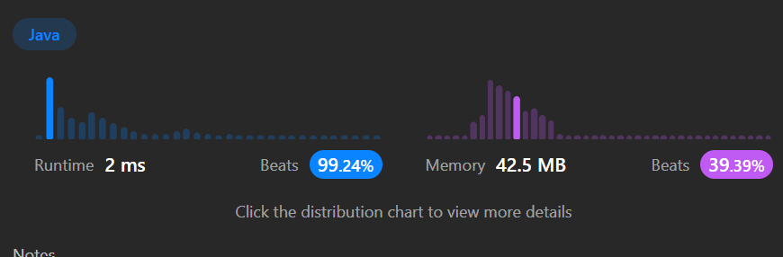

## 효율? 없 읍 니 다


### Description
- A valid parentheses string is either empty "", "(" + A + ")", or A + B, where A and B are valid parentheses strings, and + represents string concatenation.

- For example, "", "()", "(())()", and "(()(()))" are all valid parentheses strings.
A valid parentheses string s is primitive if it is nonempty, and there does not exist a way to split it into s = A + B, with A and B nonempty valid parentheses strings.

- Given a valid parentheses string s, consider its primitive decomposition: s = P1 + P2 + ... + Pk, where Pi are primitive valid parentheses strings.

- Return s after removing the outermost parentheses of every primitive string in the primitive decomposition of s.
------
### 사실상 지난번 Stack/Queue였던 괄호 짝 맞추기의 변형 버젼
  - 지난번 풀이에서 int count를 빼고 더하고 하는 것에서 count가 0이냐 아니냐라는 조건을 추가하여 0에 해당하는 것을 화려하게 감싸는 것으로 간주한다.
  - Stack을 이용하게 되면 맞으면 일단 집어넣고 ) 일 때 Pop 을 사용하여 위부터 터뜨린다. 그렇게해서 비어 있을때 포인터가 가리키는 문자열을 가져온다.
```java
package algorithm.leetcode.removeOutermostParentheses;

import org.junit.jupiter.api.Assertions;
import org.junit.jupiter.api.Test;

import java.util.Stack;

public class RemoveOutermostParentheses {


    @Test
    void solution_Test(){
        String s = "(())(())";
        String s1 = "(()())(())";
        String s2 = "(()())(())(()(()))";
        String s3 = "()()";
//        Solution solution = new Solution();
        Solution2 solution2 = new Solution2();
//        String answer = solution.removeOuterParentheses(s);
//        String answer1 = solution.removeOuterParentheses(s1);
//        String answer2 = solution.removeOuterParentheses(s2);
//        String answer3 = solution.removeOuterParentheses(s3);
        String answer4 = solution2.removeOuterParentheses(s);

//        Assertions.assertEquals(answer, "");
//        Assertions.assertEquals(answer1, "()()()");
//        Assertions.assertEquals(answer2, "()()()()(())");
//        Assertions.assertEquals(answer3, "");
        Assertions.assertEquals(answer4,"()()");
    }

}

class Solution {
    public String removeOuterParentheses(String s) {
        StringBuilder builder = new StringBuilder();
        int count = 0;
        for (char index : s.toCharArray()) {
            if (index == '(' && count++ > 0) {
                builder.append(index);
            }
            if (index == ')' && --count > 0) {
                builder.append(index);
            }
        }
        /*
        *    if(index == '(') {
                if(count > 0) s.append(c);
                count++;
            } else {
                if(count > 1) s.append(c);
                count--;
            }
        * */

        return builder.toString();
    }
}
class Solution2 {
    public String removeOuterParentheses(String S) {

        StringBuilder sb = new StringBuilder();
        int open=0, close=0, start=0;
        for(int i=0; i<S.length(); i++) {
            if(S.charAt(i) == '(') {
                open++;
            } else if(S.charAt(i) == ')') {
                close++;
            }
            if(open==close) {
                sb.append(S.substring(start+1, i));
                start=i+1;
            }
        }
        return sb.toString();
    }
}

class Solution3 {
    public String removeOuterParentheses(String s) {
        Stack<Character> stack = new Stack<>();
        int f=0,l=0;
        StringBuilder res = new StringBuilder("");
        for(int i=0;i<s.length();i++){
            if(s.charAt(i)==')'){
                stack.pop();
            }
            else{
                stack.push(s.charAt(i));
            }
            if(stack.empty()){
                res.append(s.substring(f+1,i));
                f = i+1;
            }
        }
        return res.toString();
    }
}
```