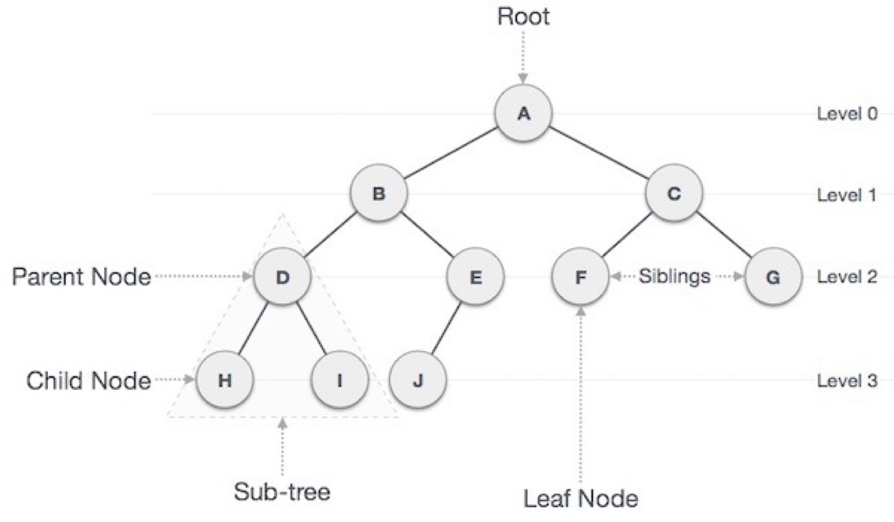

기본적인 트리(Tree)는 노드(Node)들의 집합으로, 각 노드들이 상호 연결된 구조입니다. 트리는 계층적인 구조를 표현할 때 많이 사용됩니다. 대표적으로 파일 시스템이나 데이터베이스 시스템에서 인덱스를 구현하는 데에 사용됩니다. 기본 트리 구조에서는 하나의 부모 노드와 여러 개의 자식 노드를 가질 수 있으며, 각 노드는 서로 연결되어 있다.
```java
class Node {
  public String name;
  public Node[] children;
}
```
트리는 노드로 이루어진 자료 구조

트리는 하나의 루트 노드를 갖는다.
루트 노드는 0개 이상의 자식 노드를 갖고 있다.
그 자식 노드 또한 0개 이상의 자식 노드를 갖고 있고, 이는 반복적으로 정의된다.
노드(node)들과 노드들을 연결하는 간선(edge)들로 구성되어 있다.
트리에는 사이클(cycle)이 존재할 수 없다.
노드들은 특정 순서로 나열될 수도 있고 그럴 수 없을 수도 있다.
각 노드는 부모 노드로의 연결이 있을 수도 있고 없을 수도 있다.
각 노드는 어떤 자료형으로도 표현 가능하다.

루트 노드(root node): 부모가 없는 노드, 트리는 하나의 루트 노드만을 가진다.
단말 노드(leaf node): 자식이 없는 노드, ‘말단 노드’ 또는 ‘잎 노드’라고도 부른다.
내부(internal) 노드: 단말 노드가 아닌 노드
간선(edge): 노드를 연결하는 선 (link, branch 라고도 부름)
형제(sibling): 같은 부모를 가지는 노드
노드의 크기(size): 자신을 포함한 모든 자손 노드의 개수
노드의 깊이(depth): 루트에서 어떤 노드에 도달하기 위해 거쳐야 하는 간선의 수
노드의 레벨(level): 트리의 특정 깊이를 가지는 노드의 집합
노드의 차수(degree): 하위 트리 개수 / 간선 수 (degree) = 각 노드가 지닌 가지의 수
트리의 차수(degree of tree): 트리의 최대 차수
트리의 높이(height): 루트 노드에서 가장 깊숙히 있는 노드의 깊이

이진트리(Binary Tree)는 각 노드가 최대 두 개의 자식 노드만을 가지는 트리입니다. 이진트리는 많은 경우 연산이 더 빠르고 메모리 사용량도 적은 장점을 가지고 있습니다. 이진트리는 이진탐색트리(Binary Search Tree)라는 특별한 형태로 사용되기도 하는데, 이진탐색트리는 모든 노드가 다음의 조건을 만족하는 이진트리입니다. 왼쪽 서브트리에는 노드의 값보다 작은 값의 노드들만, 오른쪽 서브트리에는 노드의 값보다 큰 값의 노드들만이 존재합니다. 이진탐색트리는 검색 속도가 매우 빠르기 때문에 데이터베이스나 검색 알고리즘 등에 많이 사용됩니다.


트리(Tree)의 특징
그래프의 한 종류이다. ‘최소 연결 트리’ 라고도 불린다.
트리는 계층 모델 이다.

트리(Tree)의 종류
트리 VS 이진 트리
이진 트리(Binary Tree)
각 노드가 최대 두 개의 자식을 갖는 트리
모든 트리가 이진 트리는 아니다.
이진 트리 순회
중위 순회(in-order traversal): 왼쪽 가지 -> 현재 노드 -> 오른쪽 가지

트리 VS 이진 트리
이진 트리(Binary Tree)
각 노드가 최대 두 개의 자식을 갖는 트리
모든 트리가 이진 트리는 아니다.
이진 트리 순회
중위 순회(in-order traversal): 왼쪽 가지 -> 현재 노드 -> 오른쪽 가지