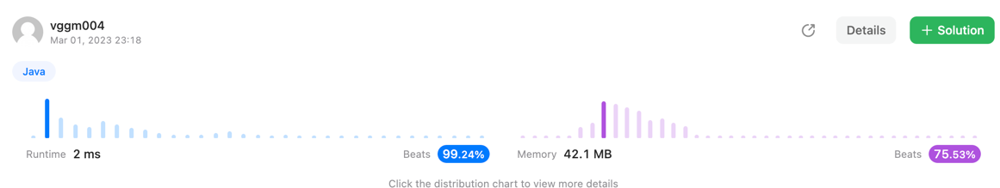
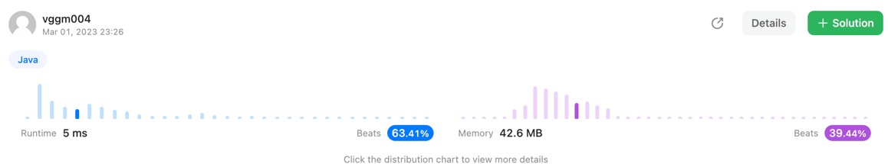

## SOLUTION
>
~~~java
class Solution {
    public String removeOuterParentheses(String s) {
        StringBuilder result = new StringBuilder();
        int sum = 0;

        for(var c : s.toCharArray()){
            if (c == '(') {
                if (sum != 0) result.append(c);
                sum++;
            } else {
                sum--;
                if (sum != 0) result.append(c);
            }
        }

        return result.toString();
    }
}
~~~
---

## TRY1
>
~~~java
class Solution {
    public String removeOuterParentheses(String s) {
        final var length = s.length();
        StringBuilder result = new StringBuilder();
        int sum = 0;
        int point = 0;

        for (int i = 0; i < length; i++) {
            sum += s.charAt(i) == '(' ? 1 : -1;

            if (sum > 0 && i > point)
                result.append(s.charAt(i));
            else if (sum == 0)
                point = i + 1;
        }

        return result.toString();
    }
}
~~~
---

## TRY2
>
~~~java
class Solution {
    public String removeOuterParentheses(String s) {
        final var length = s.length();
        StringBuilder result = new StringBuilder();
        int sum = 0;

        for (int i = 0; i < length; i++) {
            if (s.charAt(i) == '(') {
                sum++;

                if (sum > 1) result.append('(');
            } else {
                sum--;

                if (sum > 0) result.append(")");
            }
        }

        return result.toString();
    }
}
~~~
---

## TRY3 (SOLUTION)
>
~~~java
class Solution {
    public String removeOuterParentheses(String s) {
        StringBuilder result = new StringBuilder();
        int sum = 0;

        for(var c : s.toCharArray()){
            if (c == '(') {
                if (sum != 0) result.append(c);
                sum++;
            } else {
                sum--;
                if (sum != 0) result.append(c);
            }
        }

        return result.toString();
    }
}
~~~

---

## TRY4
> 
> <br>
> stack 사용시 ```메모리 사용이 우수```했다 ! ```하지만 시간이 가장 오래걸렸다```
~~~java
class Solution {
    public String removeOuterParentheses(String s) {
        Stack<Character> stack = new Stack<>();
        StringBuilder result = new StringBuilder();

        for (var c : s.toCharArray()) {
            if (c == '(') {

                if (stack.size() > 0) {
                    result.append(c);
                }

                stack.push(c);
            } else {
                stack.pop();

                if (stack.size() > 0) {
                    result.append(c);
                }
            }
        }

        return result.toString();
    }
}
~~~

---

## TRY5
>
> <br>
> LinkedList 멸망 ㅎㅎ..
~~~java
class Solution {
    public String removeOuterParentheses(String s) {
        LinkedList ll = new LinkedList();
        StringBuilder result = new StringBuilder();

        for (var c : s.toCharArray()) {
            if (c == '(') {

                if (ll.size() > 0) {
                    result.append(c);
                }

                ll.add(c);
            } else {
                ll.pop();

                if (ll.size() > 0) {
                    result.append(c);
                }
            }
        }

        return result.toString();
    }
}
~~~