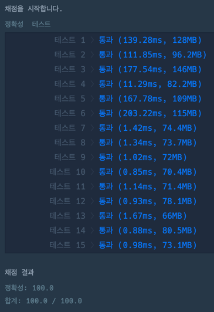
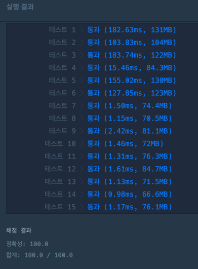

## TRY 1
> 
~~~java
import java.util.*;

class Solution {
    public String solution(int[] numbers) {
        List<String> values = new ArrayList<>();
        StringBuilder zeroBuilder = new StringBuilder();
        StringBuilder answerBuilder = new StringBuilder();
        StringBuilder thousandBuilder = new StringBuilder();

        for (int i = 0; i < numbers.length; i++) {
            final var n = numbers[i];

            if (n == 0) {
                zeroBuilder.append(0);
                continue;
            } else if (n == 9) {
                answerBuilder.append(9);
                continue;
            } else if (n == 1000) {
                thousandBuilder.append(1000);
                continue;
            }

            values.add(String.valueOf(n));
        }

        values.sort((o2, o1) -> o1.concat(o2).compareTo(o2.concat(o1)));
        values.forEach(o -> answerBuilder.append(o));

        answerBuilder.append(thousandBuilder);

        if (zeroBuilder.length() == numbers.length) {
            answerBuilder.append("0");
        } else {
            answerBuilder.append(zeroBuilder);
        }

        return answerBuilder.toString();
    }
}
~~~

## TRY2
> 
>  TRY 1 케이스에서 0, 9, 1000 의 조건을 제외하고 해보았다.
> 테스트 케이스별로 빠른 코드가 다른 것 같다
> 아마도 if 조건을 체크를 하니 조건에 빨리 걸리면 빠르고, 걸리지 않으면 더 느리고 하는 것 같다

~~~java
import java.util.*;

class Solution {
    public String solution(int[] numbers) {
        List<String> values = new ArrayList<>();
        StringBuilder answerBuilder = new StringBuilder();

        for (int i = 0; i < numbers.length; i++) {
            final var n = numbers[i];

            values.add(String.valueOf(n));
        }

        values.sort((o2, o1) -> o1.concat(o2).compareTo(o2.concat(o1)));
        values.forEach(o -> answerBuilder.append(o));

              
        if (values.get(0).equals("0")) {
            return "0";      
        } else {
            return answerBuilder.toString();
        }

    }
}
~~~