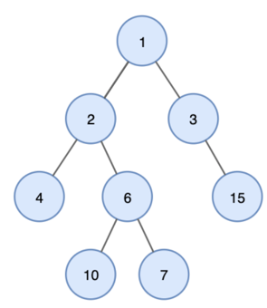
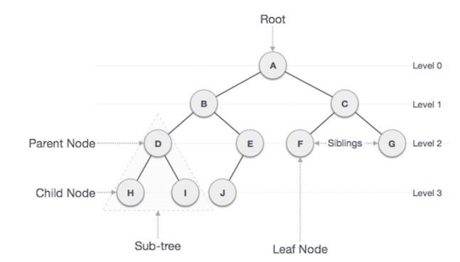
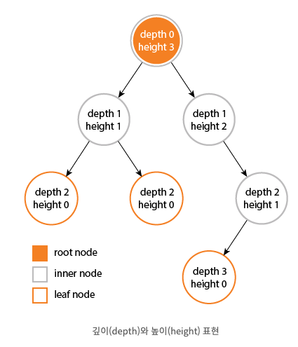
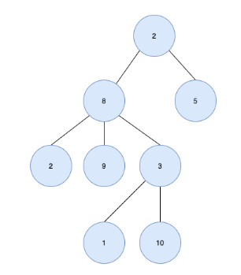
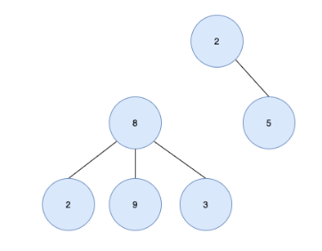
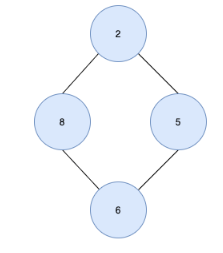
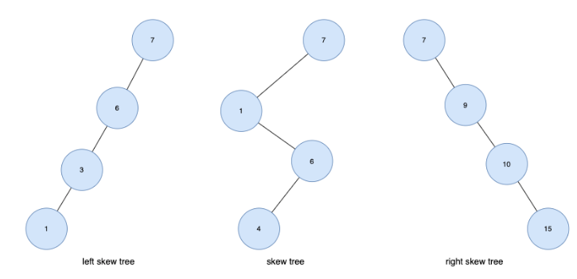

#트리
> 트리 (Tree)란 노드들이 나무 가지처럼 연결된 비선형 계층적 자료구조 <br><br>


---
## 트리 기본 용어



### 1. 노드 (Node)
- 트리를 구성하고 있는 ```기본 요소```
- 노드는 ```키 or 값```과 ```하위 노드에 대한 포인터```를 가지고 있다.

### 2. 간선 (Edge)
- 노드와 노드간의 ```연결선```

### 3. 루트 노드 (Root Node)
- 부모가 없는 ```최상위 노드```

### 4. 자식 노드 (Child Node)
- 부모 노드의 ```하위 노드```

### 5. 형제 노드 (Sibling Node)
- ```같은 부모```를 가지는 노드

### 6. 외부 노드(external/outer node), 단말 노드(terminal node), 리프 노드(leaf node)
- ```자식 노드가 없는``` 노드

### 7. 내부 노드(internal/inner node), 비 단말 노드(non-terminal node), 가지 노드(branch node)
- ```자식 노드가 하나 이상```인 노드

### 8. 깊이 (Depth)
- ```루트에서``` 특정 노드까지의 ```간선(Edge)의 수```
- 루트 노드의 깊이 : 0
- D의 깊이 : 2

### 9. 높이 (height)
- 특정 노드에서 ```리프 노드```까지 ```가장 긴 간선(Edge)의 수```
- 리프 노드의 높이 : 0
- A 노드의 높이 : 3

### 10. 레벨 (Level)
- ```루트에서``` 특정 노드까지의 ```간선(Edge)의 수```

### 11. Degree
- 노드의 ```자식 수```

### 12. Path
- 노드들 사이 ```경로의 노드들 순서```
- ex) A - H 경로 : A-B-D-H

### 13. Path Length
- ```Path 의 총 노드의 수```
- ex) A - H 경수 길이 : 4

### 14. Size
- 자신을 포함한 자손의 노드 수
- ex) B szie : 6

### 15. Width
- ```레벨```에 해당하는 ```노드 수```
- level 2 width : 4 (D,E,F,G)

### 16. Breadth
- ```리프노드의 수```
- Breadth : 5 (H,I,J,F,G)

### 17. Distance
- 두 노드 사이의 ```최단 경로 간선(Edge)의 수```
- D - J Distance : 3

### 18. Order
- 부모 노드가 가질 수 있는 최대 자식의 수

---
## 특징

### 트리 특징
>
- ```하나의 루트 노드```와 ```0개 이상의 하위 트리```로 구성
- 데이터를 순차적으로 저장하지 않는다
  - 그러므로 ```비선형 자료구조```
- 트리내에 또 다른 트리가 있는 ```재귀적 자료구조```
- 단순 순환을 갖지 않고, 연결된 ```무방향 그래프 구조```
- 노드 간에 ```부모 자식 관계```를 갖는 ```계층형 자료구조```
- 모든 자식 노드는 ```하나의 부모 노드만 갖는다```
- ```노드가 n개```인 트리는 항상 ```n-1개의 간선(Edge)```를 가진다.

### 트리가 아닌 경우
> <br> *```루트노드가 2개```여서 트리가 아니다 <br><br>
>  <br> *```사이클이 형성```되므로 트리가 아니다 

---
## 트리 종류

### 1. 편향트리 (Skew tree)
>
- ```모든 노드```가 ```한 개의 자식```만 갖는 트리
- ```왼쪽 방향```으로 ```자식을 하나씩```만 가질 떄 ```좌편향 트리 (left skew tree)```
- ```오른쪽 방향```으로 ```자식을 하나씩```만 가질 때 ```우편향 트리 (right skew tree)```

### 2. 이진트리 (Binary Tree)
- 각 노드의 ```차수(자식 노드)```가 ```2 이하```인 트리

### 3. 이진트리 (Binary Search Tree, BST)
- ```순서화된 이진 트리```
- 노드의 ```왼쪽 자식```은` ```부모의 값보다 작은 값```을 가진다
- 노드의 ```오른쪽 자식```은 ```부모의 값보다 큰 값```을 가져야 한다

### 4. 다원 탐색 트리 (m-way search tree)
- 최대 ```m개의 서브 트리```를 갖는 ```탐색 트리```

### 5. 균형트리 (Balanced Tree, B-Tree)
- ```다원 탐색트리```에서 ```높이 균형을 유지```하는 트리
- ```height-balanced m-way tree``` 라고도 한다

---
## 사용 사례
### 1. 계층적 데이터 저장
- 데이터를 계층 구조로 저장하는데 사용
- 파일 및 폴더가 계층적 트리 형태로 저장된다

### 2. 효율적인 검색 속도
- 효율적인 삽입,삭제 및 검색을 위해 트리 구조를 사용

### 3. 힙(Heap)
- 힙도 트리로 된 자료구조

### 4. 데이터 베이스 인덱싱
- 데이터베이스 인덱싱을 구현하는데 트리 사용
- ex) B-Tree, B+Tree, AVL-Tree

### 5. Trie
- 사전을 저장하는데 사용되는 특별한 종류의 트리
- 넌 누구냐?????????

---
[참고]
- [트리](https://yoongrammer.tistory.com/68)
- [트리2](https://code-lab1.tistory.com/8)