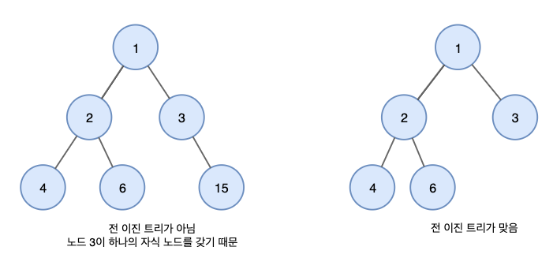

# 이진트리
> 이진트리란 모든 노드들이 둘 이하의 자식을 가진 트리 <br><br> 
>

---
## 이진트리 유형
### 1. 전 이진트리 (Full Binary Tree / Strict Binary Tree)

- 전 이진트리는 모든 노드가 ```0개``` 또는 ```2개```의 ```자식 노드```를 갖는 트리

### 2. 완전 이진트리 (Complete Binary Tree)

- ```마지막 레벨을 제외```하고 ```모든 레벨```이 ```완전히 채워져 있는``` 트리
- 마지막 레벨은 꽉차 있지 않아도 상관없지만, ```노드```가 ```왼쪽에서 오른쪽으로 채워져야``` 한다.

### 3. 포화 이진 트리 (Perfect Binary Tree)

- 포화 이진 트리는 모든 내부 노드가 두 개의 자식 노드를 가지며, 모든 잎 노드가 동일 한 깊이 또는 레벨을 갖는다.
- 결국 쉽게말해 꽉차 있는 이진 트리

### 4. 균형 이진 트리 (Balanced Binary Tree)
- 균형 이진트리는 왼쪽과 오른쪽 트리의 높이 차이가 최대 1만큼 나는 트리이다
- 예를들어 AVL 및 Red-Black 트리는 규형 이진트리이다.

---
## 이진트리 속성
> - 이진트리의 ```레벨l``` 에서의 ```노드 최대 개수는 2^l``` 이다.<br><br>
> 

> - ```최대 높이가 h```이고 하나의 노드를 가진 트리의 ```높이가 1```이라면 ```최대 노드 수```는 ```2^h - 1``` 이고, ```높이가 0``` 이라면 ```2^(h+1) - 1``` 이다. <br><br>
> 

> - ```리프 노드```의 ```높이가 1```이라면, ```최소 높이```는 ```log₂(N+1)``` 이고, 리프 노드의 ```높이가 0```이라면 ```최소 높이```는 ```log₂(N+1) - 1``` 이다. <br><br>
> 


> - ```전 이진트리```에서 ```리프 노드 수```는 항상 ```자식이 두 개인 노드```보다 ```하나 더 많다```. <br><br>
> 

---
## 이진트리 표현
> 이진트리는 ```배열``` 또는 ```연결리스트```로 표현이 가능하다.

### 배열(순차) 표현
> - ```배열```을 사용하면 ```노드 접근이 빠르고``` ```구현이 용이```하다는 장점이 있다.
> - 하지만 ```편향 이진트리의``` 경우 많인 ```공간이 낭비```될 수 있고, ```배열 크기 이상```의 ```노드를 추가할 수 없다```.  <br><br> 
> 

#### 루트 노드의 인덱스 i가 0인 경우
- 노드 인덱스 i의 왼쪽 자식은 ```2*i + 1``` 번째 노드이다
- 노드 인덱스 i의 오른쪽 자식은 ```2*i + 2``` 번째 노드이다

#### 루트 노드의 인덱스 i가 1인 경우
- 노드 인덱스 i의 왼쪽 자식은 ```2*i``` 번째 노드이다
- 노드 인덱스 i의 오른쪽 자식은 ```2*i + 1``` 번째 노드이다

### 연결 리스트 표현
> - ```포인터```를 사용하여 이진트리를 표현할 수 있다. <br><br>
> - 연결리스트는 배열보다 ```접근 속도가 느리다```
> - ```삽입/삭제```가 ```쉽고``` ```노드 수```에 ```제약이 없다```
>   

---
## 이진트리 용도
- 수식트리 (Expression Tree)
- 허프만 코딩 트리 (Huffman coding tree)
- 이진 검색 트리 (Binary Search Tree, BTS)
- 우선 순위 큐 (PQ)

---
[참고]
- [이진트리](https://yoongrammer.tistory.com/69)
- [이진트리예시](https://wonit.tistory.com/198)
- [이진트리연산](https://toward-the-future.tistory.com/entry/%EC%9E%90%EB%A3%8C-%EA%B5%AC%EC%A1%B0-2-%ED%8A%B8%EB%A6%ACTree-%EC%9D%B4%EC%A7%84-%ED%83%90%EC%83%89-%ED%8A%B8%EB%A6%ACBinary-Search-Tree-%EA%B7%A0%ED%98%95-%EC%9D%B4%EC%A7%84-%ED%83%90%EC%83%89-%ED%8A%B8%EB%A6%ACBalanced-Binary-Search-Tree-AVL-%ED%8A%B8%EB%A6%AC)