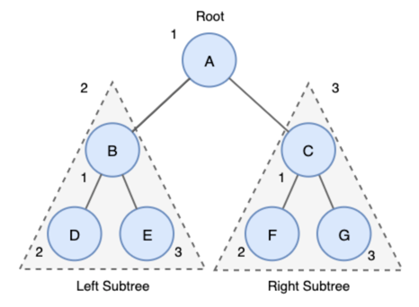
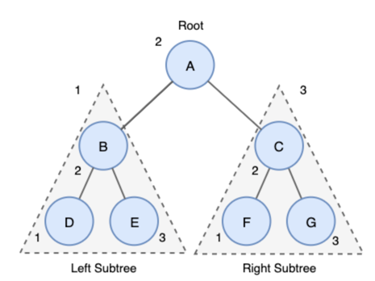
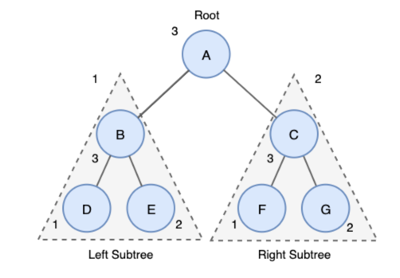

# 트리순회
> 트리의 모든 노드를 탐색하는 과정을 트리 순회라고 한다
---
## 전위 순회 (Preorder Traversal)
> 트리복사 or 전위 표기법 시에 주로 사용 된다
>  
> **A→B→D→E→C→F→G**
1. Root 노드 방문
2. 왼쪽 서브 트리를 전위 순회
3. 오른쪽 서브 트리를 전위 순회

---
## 중위 순회 (Inorder Traversal)
> 왼쪽, 오른쪽 대칭 순서로 조회한다
> 주로 BST에서 오름차순 or 내림차순으로 값을 가져올 때 사용
> 내림차순으로 가져오기 위해서는 역순 (오른쪽 -> root -> 왼쪽) 으로 중위 순회를 하면 된다
>   
> **D→B→E→A→F→C→G**

1. 왼쪽 서브 트리를 중위 순회
2. Root 노드를 방문
3. 오른쪽 서브 트리를 중위 순회
---
## 후위 순회
> 주로 트리를 삭제하는데 사용
>   
> **D→E→B→F→G→C→A**

1. 왼쪽 서브트리를 후위 순회
2. 오른쪽 서브트리를 후위 순회
3. Root 노드를 방문

[참고]
- [트리순회](https://yoongrammer.tistory.com/70)
