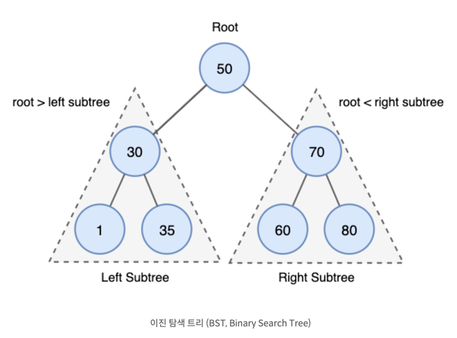
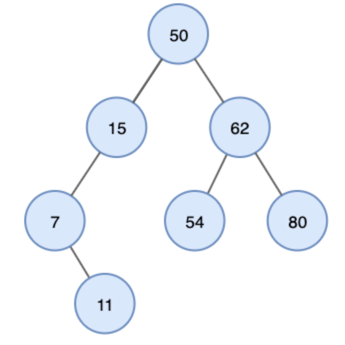
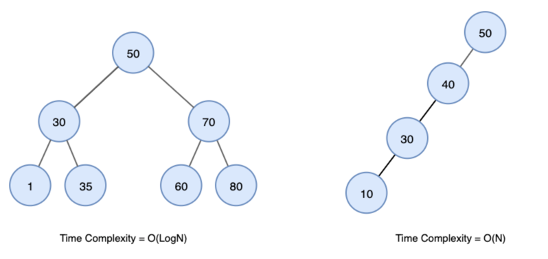

# 이진탐색트리
> 정렬된 이진트리
> 1. 왼쪽 자식 노드는 부모보다 작은 값의 노드만 포함된다
> 2. 오른쪽 자식 노드는 부모보다 작은 값의 노드만 포함된다
> 3. 왼쪽, 오른쪽 하위 트리도 이진 탐색 트리여야 한다.
> 4. 중복된 키를 허용하지 않는다
> 
> 

---
## 이진탐색트리 특징
- 중위 순회를 통해 정렬된 순서로 가져올 수 있다.
>  
> -> 7, 11, 15, 50, 54, 62, 80

- 시간복잡도 최소 O(logN), 최대 O(N)
> 
---
[참고]
- [이진탐색트리(BTS)](https://yoongrammer.tistory.com/71)
- [이진트리연산](https://toward-the-future.tistory.com/entry/%EC%9E%90%EB%A3%8C-%EA%B5%AC%EC%A1%B0-2-%ED%8A%B8%EB%A6%ACTree-%EC%9D%B4%EC%A7%84-%ED%83%90%EC%83%89-%ED%8A%B8%EB%A6%ACBinary-Search-Tree-%EA%B7%A0%ED%98%95-%EC%9D%B4%EC%A7%84-%ED%83%90%EC%83%89-%ED%8A%B8%EB%A6%ACBalanced-Binary-Search-Tree-AVL-%ED%8A%B8%EB%A6%AC)