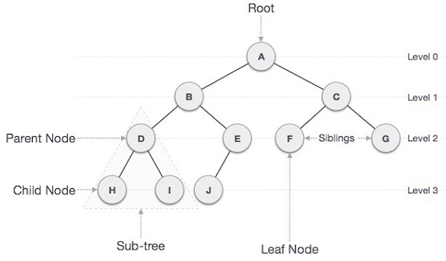
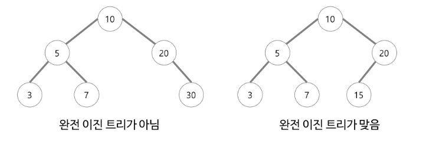
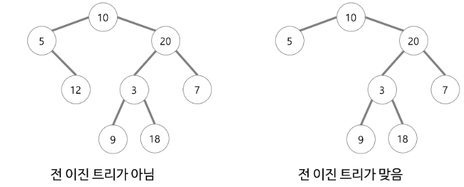
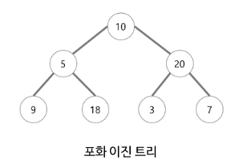
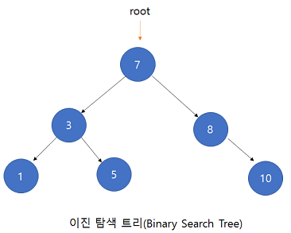

# 트리(Tree) 자료구조
  
## 트리 란?
트리는 그래프 자료구조의 일종이다.  
(그래프 자료구조는 노드(vertex, 정점)와 엣지(edge, 간선)으로 이루어진 자료구조이다.)  
트리 자료구조는 한 노드에서 시작해서 자기 자신으로 돌아오는 순환구조가 없는 그래프 자료구조다.

## 트리 자료구조의 구성성분  
* 부모 노드(Parent node)
  * 한 노드의 직계 상위 노드
* 자식 노드(Child node)
  * 한 노드의 직계 하위 노드
* 조상 노드(Ancestor node)
  * 루트 노드에서 임의의 노드까지의 경로를 이루고 있는 노드
* 자손 노드(Desendent node)
  * 임의의 노드 하위에 연결된 모든 노드
* 루트 노드(Root node)  
  * 부모가 없는 최상위 레벨 노드, 트리는 루트 노드를 하나만 가진다.
* 단말 노드(Leaf node)
  * 자식이 없는 노드
* 간선(edge)
  * 노드를 연결하는 선
* 내부 노드(Internal node)
  * 단말 노드가 아닌 노드
* 형제(Sibling)
  * 같은 부모를 가진 노드

## 트리 자료구조의 용어
* 노드의 크기(size)
  * 자신을 포함한 모든 자손 노드의 개수
* 노드의 깊이(depth)
  * 루트에서 어떤 노드에 도달하기 위해 거쳐야 하는 간선의 수
* 노드의 레벨(level)
  * 트리의 특정 깊이를 가지는 노드의 집합
* 노드의 차수(degree)
  * 어떤 노드가 가지고 있는 자식 노드의 개수
* 트리의 차수
  * 트리의 최대 차수
* 트리의 높이(height)
  * 루트 노드에서 가장 깊이가 큰 노드의 깊이
* 서브트리(subtree)
  * 루트 노드 아래에 파생되는 나머지 노드
* 포레스트(forest)
  * 트리의 집합

## 이진 트리(Binary Tree)
각 노드가 최대 두 개의 자식을 갖는 트리를 이진 트리라 한다.  
이진 트리에서는 서브 트리간에 순서가 존재해서 왼쪽 서브트리와 오른쪽 서브트리를 구별할 수 있다.  

* 이진 트리의 성질
  * n개의 노드를 가진 이진 트리는 정확히 n-1개의 간선을 가진다.
  * 높이가 h인 이진 트리의 경우 최소 h개의 노드를 가지며 최대 (2^h)-1 개의 노드를 가진다.
  * n개의 노드를 가지는 이진 트리의 높이는 최대 n이거나 최소 log2(n+1) 이 된다.

* 이진 트리의 종류
  * 완전 이진 트리 (Complete Binary Tree)
    *   
    * 트리의 모든 높이에서 노드가 꽉 차 있는 이진 트리
    * 마지막 레벨은 꽉 차있지 않아도 되지만 노드가 왼쪽에서 오른쪽으로 채워져야 한다
  * 전 이진 트리 (Full Binary tree)
    * 
    * 모든 노드가 0개 또는 2개의 자식을 갖는 이진 트리  
  * 포화 이진 트리 (Perfect Binary Tree)
    *   
    * 전 이진 트리이면서 완전 이진 트리인 경우
    * 마지막 레벨에서 노드의 개수가 최대가 되어야 한다

## 이진 트리의 표현
* 배열 표현법
  * 포화 이진 트리나 완전 이진 트리의 경우 많이 사용하는 방법
  * 각 노드에 번호를 매긴 후 번호에 따라서 배열에 저장한다
  * 완전 이진 트리가 아닐 경우 사용은 가능하지만 메모리 공간의 낭비가 심해진다
* 링크 표현법
  * 노드를 구조체로 표현하고 각 노드가 포인터를 가지고 있어 노드와 노드를 연결한다
  * 객체지향 언어에서는 노드를 클래스로 표현하고 클래스의 멤버로 다른 노드와 연결한다

## 이진 트리의 순회
* 순회(traversal)란?
  * 트리에 속하는 모든 노드를 한 번씩 방문하여 노드가 가지고 있는 데이터를 목적에 맞게 처리하는 것
* 이진 트리 순회 방법
  * 전위 순회(preorder traversal)
    * 루트, 왼쪽 서브 트리, 오른쪽 서브 트리 순으로 방문
  * 중위 순회(inorder traversal)
    * 왼쪽 서브 트리, 루트, 오른쪽 서브 트리 순으로 방문
  * 후위 순회(postorder traversal)
    * 왼쪽 서브 트리, 오른쪽 서브 트리, 루트 순으로 방문
  * 전위, 중위, 후위 순회 방법은 자식 노드를 먼저 처리할 것인지, 부모 노드를 먼저 처리할 것인지에 따라 결정하면 된다
  * 레벨 순회(level order)
    * 각 노드를 레벨 순으로 검사하는 방법, 동일한 레벨의 경우 좌에서 우로 방문
    * 레벨 순회는 큐를 사용해 구현한다

## 이진 트리와 관련된 연산
* 전체 노드 개수 구하기
* 단말 노드 개수 구하기
* 높이 구하기

## 이진 탐색 트리
  
* 이진 탐색 트리란?
  * 이진 트리 기반의 탐색을 위한 자료구조
* 탐색에 관련된 용어
  * 레코드(record) : 하나 이상의 필드로 구성된 데이터
  * 테이블(table) : 레코드의 집합
  * 키(key) : 레코드를 구분하는 하나의 필드
  * 주요 키(primary key) : 다른 키와 중복되지 않는 고유한 값을 가지는 키
* 이진 탐색 트리의 정의
  * 모든 노드의 키는 유일하다
  * 왼쪽 서브 트리의 키는 루트의 키보다 작다
  * 오른쪽 서브 트리의 키는 루트의 키보다 크다
  * 왼쪽과 오른쪽 서브 트리도 이진 탐색 트리다
* 이진 탐색 트리의 탐색 연산
  * 주어진 탐색 키 값과 현재의 루트 노드의 키 값을 비교한 후 다음 3가지 방법으로 나누어 탐색
  * 비교한 결과가 같으면 탐색이 끝난다
  * 주어진 키 값이 루트 노드의 키 값보다 작으면 이 루트 노드의 왼쪽 자식을 기준으로 다시 탐색을 시작한다
  * 주어진 키 값이 루트 노드의 키 값보다 크면 이 루트 노드의 오른쪽 자식을 기준으로 다시 탐색을 시작한다
* 이진 탐색 트리의 성능
  * 최선의 경우 O(log2 n), 최악의 경우 O(n)의 복잡도를 가진다
  * 최악의 경우 순차 탐색과 시간 복잡도가 같다

