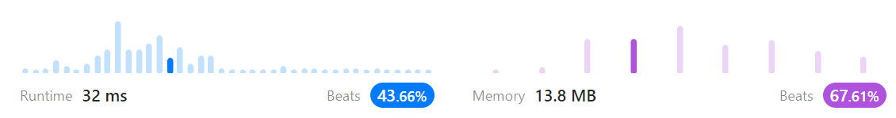
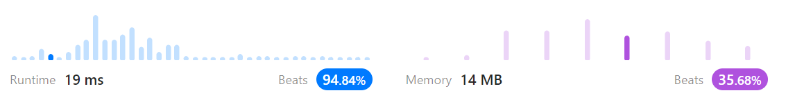
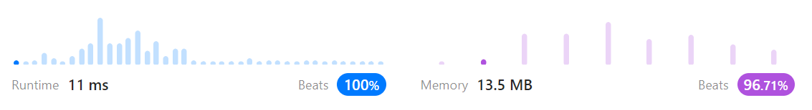
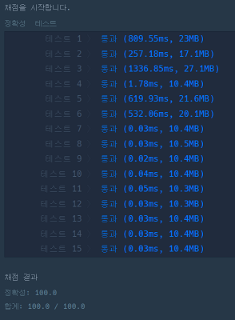

# 문제풀이
## 1021. Remove Outermost Parentheses

### Discription  
요약)  
괄호 조합 문자열이 입력되었을 때 (예: "(())(())")  
각 괄호로 둘러쌓인 블록 중 가장 바깥쪽 괄호를 제거한 문자열을 반환하라 (예: "()()")  
https://leetcode.com/problems/remove-outermost-parentheses/

### Solution

```python
class Solution(object):
    def removeOuterParentheses(self, s):
        result = ""
        outer = False
        left = 0

        for ss in s:
            if outer == False:
                if ss == '(':
                    outer = True
            else:
                if ss == '(':
                    left += 1
                    result += ss
                else:
                    if left > 0:
                        left -= 1
                        result += ss
                    else:
                        outer = False

        return result
```
  
문자열을 순회하면서 첫번째 '('를 만나면 결과에 포함하지 않고  
두 번째 '('부터 결과에 포함시킨다  
첫 번째 '('와 쌍이 되는 ')'를 만나면 블록을 종료한다(outer 변수로 판단)   

```python
class Solution(object):
    def removeOuterParentheses(self, s):
        result = []
        outer = False
        left = 0

        for ss in s:
            if outer == False:
                if ss == '(':
                    outer = True
            else:
                if ss == '(':
                    left += 1
                    result.append(ss)
                else:
                    if left > 0:
                        left -= 1
                        result.append(ss)
                    else:
                        outer = False

        return "".join(result)
```
  
위와 동일한 방법인데  
매번 문자열 연산을 하는 것 보다 배열에 담아두고 한 번에 합치는 게 더 빠르다.  

```python
class Solution(object):
    def removeOuterParentheses(self, s):
        result = []
        left = 0

        for ss in s:
            if ss == '(':
                left += 1
                if left > 1:
                    result.append(ss)
            else:
                if left > 1:
                    result.append(ss)
                left -= 1

        return "".join(result)
```
  
똑같이 방법은 위와 동일한데  
가장 바깥 괄호를 별도 변수로 판단하지 않고 '('괄호쌍 갯수로 판단했다. (if문개수 감소)  

## 가장 큰 수

### 문제 설명
요약)  
0 또는 양의 정수가 주어졌을 때, 정수를 이어 붙여 만들 수 있는 가장 큰 수를 알아내 주세요.
https://school.programmers.co.kr/learn/courses/30/lessons/42746  

### Solution

```python
def solution(numbers):
    n = len(str(max(numbers)))
    snumbers = list(map(lambda x: str(x), numbers))
    snumbers.sort(key=lambda x: x*n, reverse=True)
    return str(int("".join(snumbers)))
```
  
map 함수를 이용해 int 리스트를 string 리스트로 만든다.  
문자열 내림차순 정렬을 한다.  
--> 문자열로 정렬을 하면 앞자리부터 정렬하기 때문에 앞자리가 큰 애들이 큰 수가 된다  
정렬시 자릿수를 맞춰주기 위해 문자열을 가장 큰 숫자의 자리수만큼 반복한 것을 비교한다.  
예) ["3", "30"]을 비교할 경우 ["33", "3030"]로 바꿔서 비교한다  
앞에서부터 비교가 될 때 까지 비교하기 때문에 "33", "30"이 비교된다. 결과적으로 3이 더 앞으로 정렬된다.  
정렬이 된 문자열을 합쳐서 출력한다.  
0이 여러개인 경우 "00000"같은 문자열이 나올 수 있으므로  
문자열을 int로 변환한 뒤 다시 string으로 변환해서 반환한다.  


