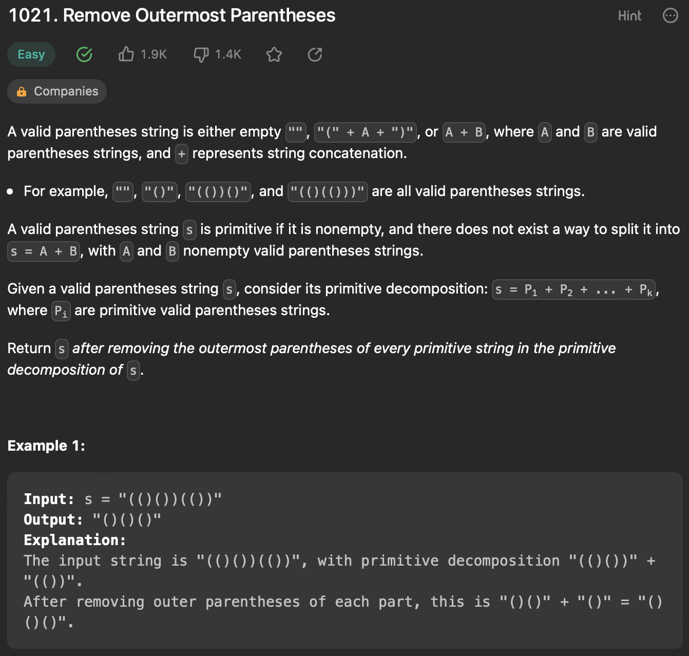
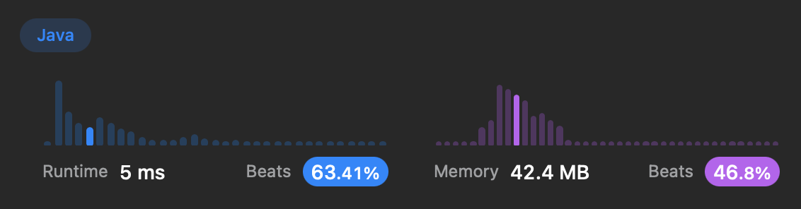
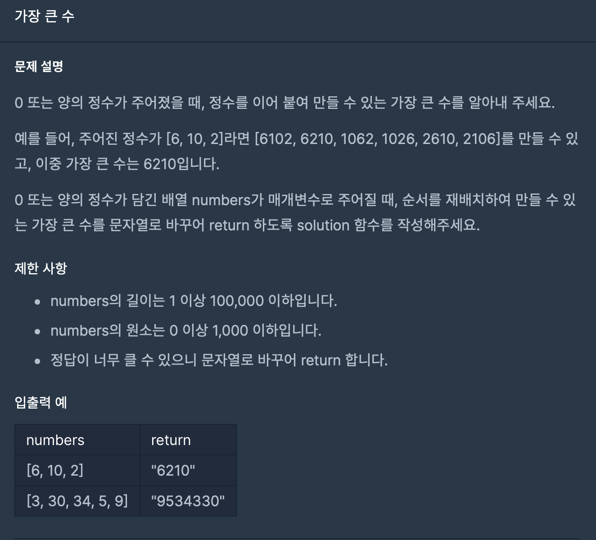
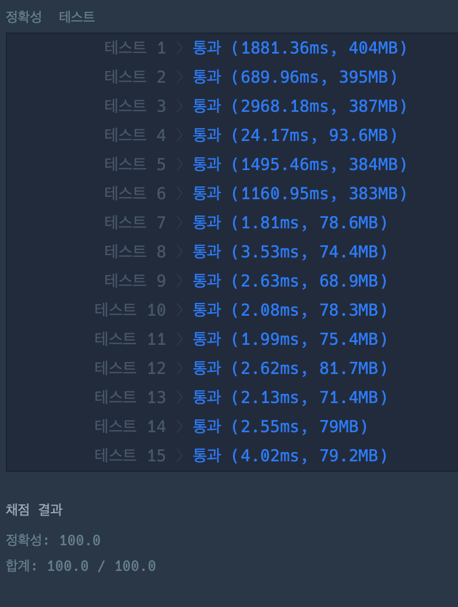

## LeetCode 1021. Remove Outermost Parentheses

### 문제



```java
class Solution {
public String removeOuterParentheses(String s) {
StringBuilder sb = new StringBuilder();
int cnt = 0;
int stIdx = 0;

        for (int i = 0; i < s.length(); i++) {
            if (s.charAt(i) == '(') {
                cnt++;
            } else if (s.charAt(i) == ')') {
                cnt--;
            }s
            
            if (cnt == 0) {
                sb.append(s.substring(stIdx + 1, i));
                stIdx = i + 1;
            }
        }
        
        return sb.toString();
    }
}
```

###속도




## 프로그래머스.가장큰수

###문제



```java
import java.util.Arrays;
import java.util.Comparator;

class Solution {
    public String solution(int[] numbers) {
        String answer = "";
        String [] str = new String[numbers.length];
        for(int i=0; i<numbers.length;i++){
            str[i] = String.valueOf(numbers[i]);
        }

        Arrays.sort(str, new Comparator<String>() {
            @Override
            public int compare(String a, String b) {
                return (b+a).compareTo(a+b);
            }
        });

        if (str[0].equals("0")) return "0";
        
        for(String s: str) answer += s;
        return answer;
        }
    }
```

###속도



