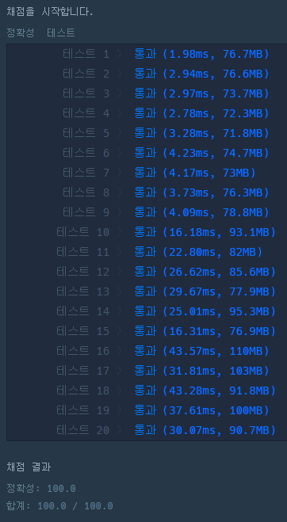

```java
class Solution {
    public boolean checkTree(String binary, int start, int end){
        if(end-start >= 2){
            int middle = (start+end)/2;
            int left = middle-1;
            int right = middle+1;

            if(binary.charAt(middle) == '0' && binary.substring(start, end+1).indexOf('1') > -1){
                return false;
            }

            else{       
                // LEFT
                boolean leftCheck = checkTree(binary, start, left);
                // RIGHT
                boolean rightCheck = checkTree(binary, right, end);
                return leftCheck && rightCheck;
            }
        }
        else{
            return true;
        }
    }

    public int[] solution(long[] numbers) {
        int[] answer = new int[numbers.length];

        for(int i=0; i<numbers.length; i++){
            // 2진수로
            String binary = Long.toBinaryString(numbers[i]);

            // 0이면 0 리턴
            if("0".equals(binary)){
                answer[i] = 0;
            }
            // 1이면 첫 노드만 생성이라 1리턴
            else if("1".equals(binary)){
                answer[i] = 1;
            }
            // 그 이외의 값이면 2의 배수만큼에서 최상위 부모노드값을 뺀 값만큼만 트리생성
            else {
                int X = 1;

                while ((int) Math.pow(2, X) - 1 < binary.length()) {
                    X++;
                }

                // Math.pow 제곱 2의 N제곱
                int rest = ((int) Math.pow(2, X) - 1) - binary.length();

                String temp = "";
                for (int j = 0; j < rest; j++) {
                    temp += "0";
                }

                binary = temp + binary;
                answer[i] = checkTree(binary, 0, binary.length()-1) ? 1 : 0;
            }
        }
        return answer;
    }
}
```
