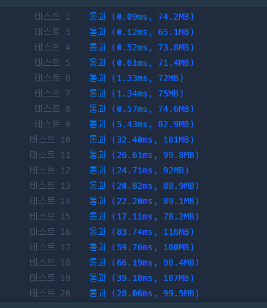

```java
package algorithm.programars;

import org.junit.jupiter.api.Assertions;
import org.junit.jupiter.api.Test;


public class ExpressionBinaryTreeToNumber {
    /**
     * 당신은 이진트리를 수로 표현하는 것을 좋아합니다.
     * <p>
     * 이진트리를 수로 표현하는 방법은 다음과 같습니다.
     * <p>
     * 이진수를 저장할 빈 문자열을 생성합니다.
     * 주어진 이진트리에 더미 노드를 추가하여 포화 이진트리로 만듭니다. 루트 노드는 그대로 유지합니다.
     * 만들어진 포화 이진트리의 노드들을 가장 왼쪽 노드부터 가장 오른쪽 노드까지, 왼쪽에 있는 순서대로 살펴봅니다. 노드의 높이는 살펴보는 순서에 영향을 끼치지 않습니다.
     * 살펴본 노드가 더미 노드라면, 문자열 뒤에 0을 추가합니다. 살펴본 노드가 더미 노드가 아니라면, 문자열 뒤에 1을 추가합니다.
     * 문자열에 저장된 이진수를 십진수로 변환합니다.
     * 이진트리에서 리프 노드가 아닌 노드는 자신의 왼쪽 자식이 루트인 서브트리의 노드들보다 오른쪽에 있으며, 자신의 오른쪽 자식이 루트인 서브트리의 노드들보다 왼쪽에 있다고 가정합니다.
     * <p>
     * 다음은 이진트리를 수로 표현하는 예시입니다.
     * <p>
     * 주어진 이진트리는 다음과 같습니다.
     * <p>
     * [7, 42, 5]	[1, 1, 0]
     * [63, 111, 95]	[1, 1, 0]
     */
    @Test
    void expressionBinaryTreeToNumber() {

        Solution1 solution1 = new Solution1();

        int[] result = solution1.solution(new long[]{7, 42, 5});
        for (int index :
                result) {
            System.out.println(index);
        }
        Assertions.assertArrayEquals(new int[]{1, 1, 0}, result);

    }
}

class Solution1 {
        private int[] answer ;

    public int[] solution(long[] numbers) {
        answer = new int[numbers.length];
        for (int i = 0; i < numbers.length; i++) {
            StringBuilder pointer = new StringBuilder(Long.toBinaryString(numbers[i]));
            int nodeSize = 0;
            while ((int) Math.pow(2, nodeSize) - 1 < pointer.length()) {
                nodeSize++;
            }
            while ((int) Math.pow(2, nodeSize) - 1 != pointer.length()) {
                pointer = pointer.insert(0, "0");
            }
//            System.out.println(pointer);

            if (checkNode(String.valueOf(pointer))) {
                answer[i] = 1;
            }
        }
/*        for (int index :
                answer) {
            System.out.println(index);
        }*/
        return answer;
    }

    private static boolean checkNode(String number) {
        boolean isCanExpress = true;

        int rootIndex = (number.length() - 1) / 2; //  root의 인덱스
        char root = number.charAt(rootIndex);
        if (root == '0'){
            return false;
        }
//        System.out.println("root : " + root);
        String left = number.substring(0, rootIndex);
        String right = number.substring(rootIndex + 1, number.length());

        if (root == '0' && (left.charAt((left.length() - 1) / 2) == '1' || right.charAt((right.length() - 1) / 2) == '1')) {
            return false;
        }

        if (left.length() >= 3) {
            isCanExpress = checkNode(left);
            if (isCanExpress) {
                isCanExpress = checkNode(right);
            }
        }
        return isCanExpress;

    }
}
```