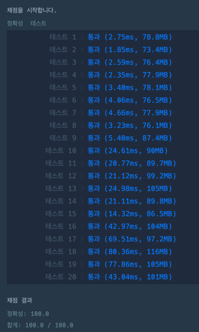

> 1. 전체 노드 개수는 2^-1
> 2. 부모노드는 덤프 노드가 되어서는 안된다

~~~java
class Solution {
    public int[] solution(long[] numbers) {
        int[] answer = new int[numbers.length];
        
        for (int i = 0; i < numbers.length; i++) {
            String binary = Long.toBinaryString(numbers[i]);
            int binaryLength = binary.length();
            int square = 0;
            
            while((int) Math.pow(2, square) - 1 < binaryLength) {
                square++;
            }
            
            int nodeCount = (int) Math.pow(2, square) - 1;
            
            while (nodeCount != binary.length()) {
                binary = "0" + binary;
            }
           
            answer[i] = this.search(binary);
        }
        
        return answer;
    }
    
    private int search(String binary) {
        int binaryLength = binary.length();
        int rootIndex = this.findRootIndex(binary);
        String leftBinary = binary.substring(0, rootIndex);
        String rightBinary = binary.substring(rootIndex + 1, binaryLength);
        char root = binary.charAt(rootIndex);
        
        if (root == '0') {
            int leftRootIndex = this.findRootIndex(leftBinary);
            int rightRootIndex = this.findRootIndex(rightBinary);
            
            if (leftBinary.charAt(leftRootIndex) == '1' 
                || rightBinary.charAt(rightRootIndex) == '1') {
                return 0;
            }
        }
        
        if (leftBinary.length() >= 3) {
            return this.search(leftBinary) == 1 ? this.search(rightBinary) : 0;
        }
        
        return 1;
    }
    
    private int findRootIndex(String binary) {
        return (binary.length() - 1) / 2;
    }
}
~~~