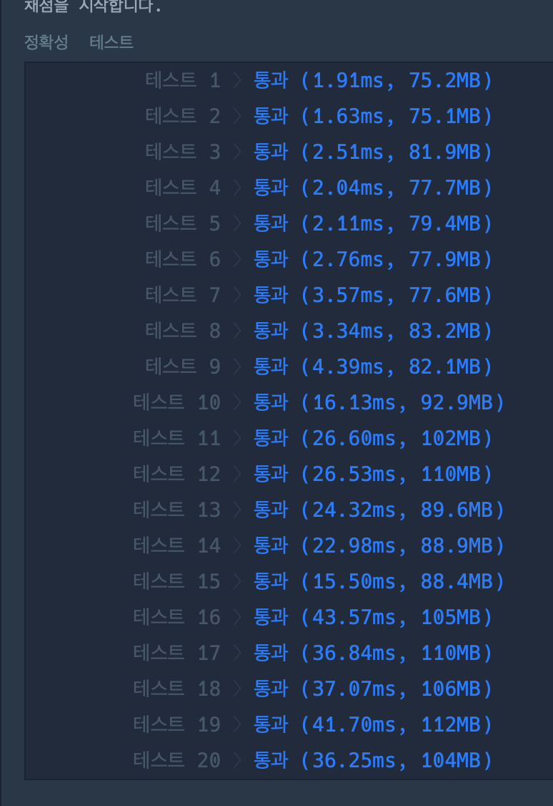
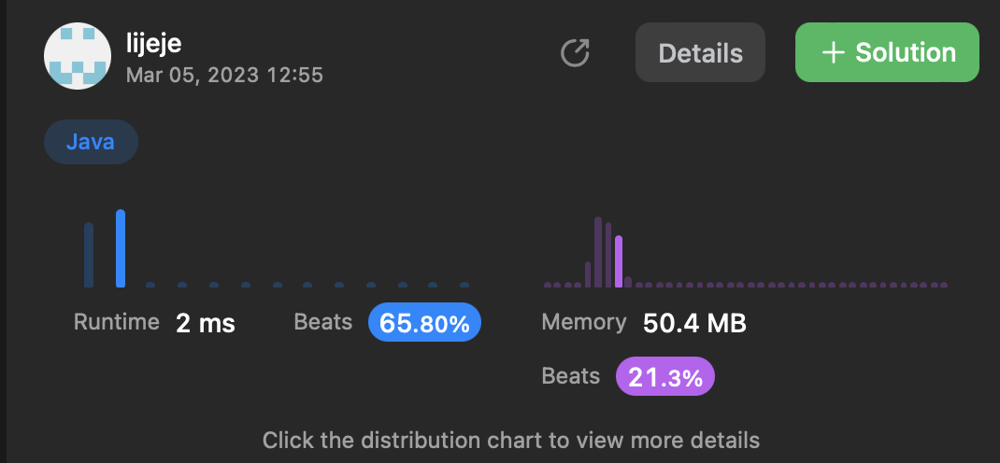

### 프로그래머스


```java
class solution{
public int[] solution(long[] numbers) {
        int[] answer = new int[numbers.length];
       // String[] binarynumKbers = new String[numbers.length]; //이진수로 바꿔준 값을 넣기
        StringBuilder sb = new StringBuilder();

        // 십진수를 이진수로 바꿔주기
//        for(int i=0; i<numbers.length;i++){
//            long number = numbers[i];
//            while(number != 0 ){//|| number != 1
//
//                sb.append(String.valueOf(number % 2));
//                number = number/2;
//                if(number == 1 ||number == 0 ) {
//                    sb.append(number);
//                    break;
//                };
//            }
//            binarynumbers[i] = sb.reverse().toString();
//            sb.setLength(0);
//        }

        // 함수가 있었군요 ㅇㅅㅇ
        for(int i = 0; i<numbers.length;i++){
            String currentStr = Long.toBinaryString(numbers[i]);
            int j = 0;
            while((int)Math.pow(2, j)-1 < currentStr.length()) {
                j++;
            }
            while((int)Math.pow(2, j)-1 != currentStr.length()) {
                currentStr = "0"+ currentStr;
            }
            if(dfs(currentStr)) {
                answer[i] = 1;
            }
        }


        return answer;
    }


    private static boolean dfs(String number) {
        boolean valid = true;

        int mid = (number.length()-1)/2;
        char root = number.charAt(mid);
        String left = number.substring(0,mid);
        String right = number.substring(mid+1,number.length());

        if(root == '0' && (left.charAt((left.length()-1)/2)=='1' || right.charAt((right.length()-1)/2)=='1')){
            return false;
        }

        if(left.length() >= 3) {
            valid = dfs(left);
            if(valid) {
                valid = dfs(right);
            }
        }
        return valid;
    }
}
```




### 릿코드

```java
    class Solution {

    TreeNode target,res;
    public final TreeNode getTargetCopy(final TreeNode original, final TreeNode cloned, final TreeNode target) {
        this.target = target;
        inorder(original,cloned);
        return res;
    }

    public void inorder(final TreeNode original, final TreeNode cloned){
        if(original != null){
            inorder(original.left, cloned.left);
            if(original == target) res = cloned;
            inorder(original.right, cloned.right);
        }
    }
}
```
