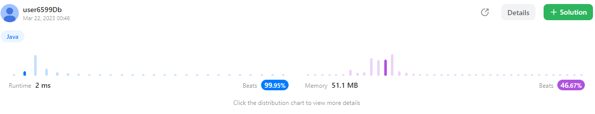

문제 2. https://leetcode.com/problems/number-of-islands/

```java
class Solution {
    public int numIslands(char[][] grid) {
        int answer = 0;
        for(int i=0; i<grid.length; i++){
            for(int j=0; j<grid[i].length; j++){
                if(grid[i][j] == '1'){
                    // 그리드행렬의 값이 1이면 섬이니 주변 체크
                    islandCheck(grid, i, j);
                    answer++;    
                }
            }
        }
        return answer;
    }
    
    public void islandCheck(char[][] grid, int row, int col){
        grid[row][col] = '-'; //이미 체크했으니 체크 안하도록 값 변경
        
        if(row < grid.length - 1 && grid[row+1][col] == '1'){
            islandCheck(grid, row+1, col); // 상
        }
        if(row > 0 && grid[row-1][col] == '1'){
            islandCheck(grid, row-1, col); // 하     
        }
        if(col > 0 && grid[row][col-1] == '1'){
            islandCheck(grid, row, col-1); // 좌    
        }
        if(col < grid[row].length - 1 && grid[row][col+1] == '1'){
            islandCheck(grid, row, col+1); // 우    
        }
    }
}
```
