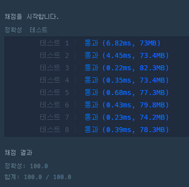
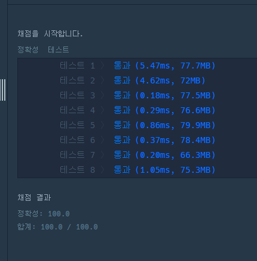

문제 3. https://school.programmers.co.kr/learn/courses/30/lessons/43165
```java
class Solution {
    int answer = 0;
    public int solution(int[] numbers, int target) {
        if(numbers.length == 0) {
            return 0;
        }
        sumNumbers(numbers,target,0,0);
        return answer;
    }
    
    private void sumNumbers(int[] numbers, int target, int index, int sum){
        if(index == numbers.length){
            if(sum == target)  {
                answer++;
            }
        }else{
            sumNumbers(numbers, target, index+1, sum+numbers[index]);//현재값을 더해서 다음 서치
            sumNumbers(numbers, target, index+1, sum-numbers[index]);//현재값을 빼서 다음 서치
        }   
    }
}
```



```java
class Solution {
    int answer = 0;
    int answerTarget = 0;
    int numbersLength = 0;
    public int solution(int[] numbers, int target) {
        answerTarget = target;
        numbersLength = numbers.length;
        if(numbersLength == 0) {
            return 0;
        }
        sumNumbers(numbers,0,0);
        return answer;
    }
    
    private void sumNumbers(int[] numbers, int index, int sum){
        if(index == numbersLength){
            if(sum == answerTarget)  {
                answer++;
            }
        }else{
            sumNumbers(numbers, index+1, sum+numbers[index]);//현재값을 더해서 다음 서치
            sumNumbers(numbers, index+1, sum-numbers[index]);//현재값을 빼서 다음 서치
        }   
    }
}
```
