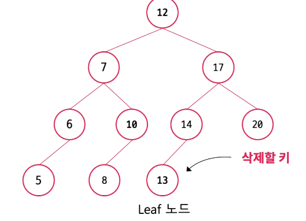
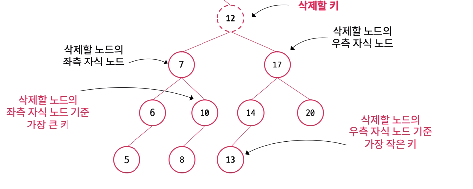
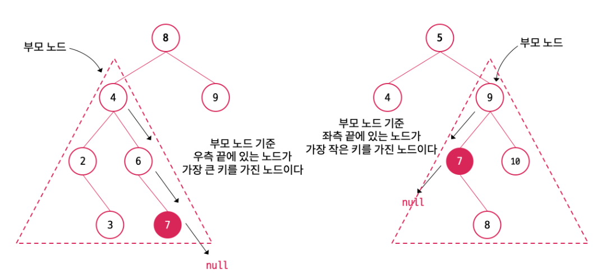
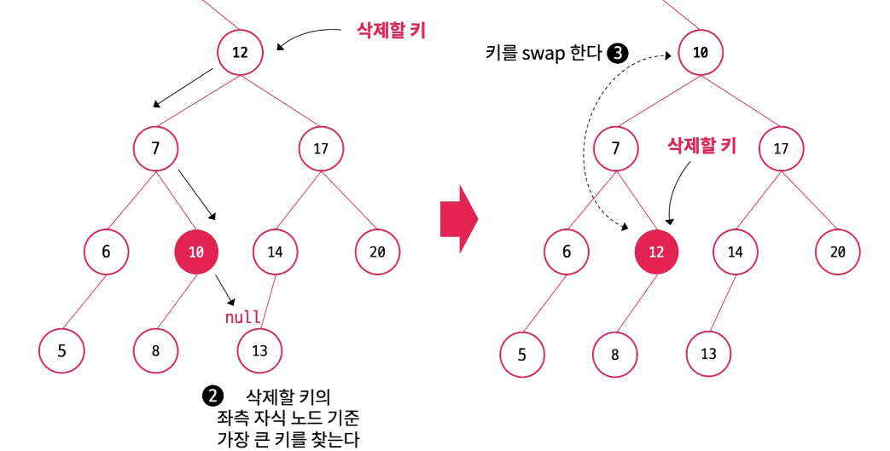
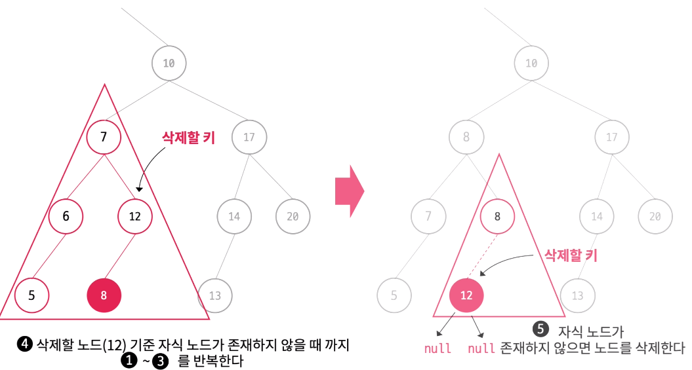

```java

class Node {
  int value;
  Node left;
  Node right;
  public Node(int value) {
      this.value = value;
      this.left = null;
      this.right = null;
  }
}


class BinaryTree {
    Node root = null;

    /**
     * 새로운 노드 삽입
     */
    public void insert(int val) {
        if (root == null) {
            // 최상위 노드에 값 넣기
            root = new Node(val);
        } else {
            Node head = root;
            Node currentNode;

            while (true) {
                currentNode = head;

                /*
                 * 현재의 루트보다 작은 경우, 왼쪽으로 탐색을 한다.
                 */
                if (head.value > val) {
                    head = head.left;

                    /*
                     * 왼쪽 자식 노드가 비어있는 경우, 해당 위치에 추가할 노드를 삽입한다.
                     * 현재 currenNode head를 가리키고 있다.
                     */
                    if (head == null) {
                        currentNode.left = new Node(val);
                        break;
                    }
                } else {
                    /*
                     * 현재의 루트보다 큰 경우, 오른쪽으로 탐색을 한다.
                     */
                    head = head.right;

                    /*
                     * 오른쪽 자식 노드가 비어있는 경우, 해당 위치에 추가할 노드를 삽입한다.
                     * 현재 currenNode head를 가리키고 있다.
                     */
                    if (head == null) {
                        currentNode.right = new Node(val);
                        break;
                    }
                }
            }
        }
    }

    /**
     * 특정 노드 삭제
     */
    public boolean removeNode(int val) {
        Node removeNode = root;
        Node parentOfRemoveNode = null;

        while (removeNode.value != val) {
            parentOfRemoveNode = removeNode;

            /* 삭제할 값이 현재 노드보다 작으면 왼쪽을 탐색한다. */
            if (removeNode.value > val) {
                removeNode = removeNode.left;
            } else {
                removeNode = removeNode.right;
            }

            /*
             * 값 대소를 비교하며 탐색했을 때
             * 잎 노드(Leaf node)인 경우 삭제를 위한 탐색 실패
             */
            if (removeNode == null)
                return false;

        }

        /* 자식 노드가 모두 없을 때 */
        if (removeNode.left == null && removeNode.right == null) {
            /* 삭제 대상이 트리의 루트일 때 */
            if (removeNode == root) {
                root = null;
            } else if (removeNode == parentOfRemoveNode.right) {
                parentOfRemoveNode.right = null;
            } else {
                parentOfRemoveNode.left = null;
            }
        }

        /* 오른쪽 자식 노드만 존재하는 경우 */
        else if (removeNode.left == null) {
            if (removeNode == root) {
                root = removeNode.right;
            } else if (removeNode == parentOfRemoveNode.right) {
                /*
                 * 삭제 대상의 오른쪽 자식 노드를 삭제 대상 위치에 둔다.
                 */
                parentOfRemoveNode.right = removeNode.right;
            } else {
                parentOfRemoveNode.left = removeNode.right;
            }
        }

        /* 왼쪽 자식 노드만 존재하는 경우 */
        else if (removeNode.right == null) {
            if (removeNode == root) {
                root = removeNode.left;
            } else if (removeNode == parentOfRemoveNode.right) {
                parentOfRemoveNode.right = removeNode.left;
            } else {
                /*
                 * 삭제 대상의 왼쪽 자식을 삭제 대상 위치에 둔다.
                 */
                parentOfRemoveNode.left = removeNode.left;
            }
        }

        /*
         * 두 개의 자식 노드가 존재하는 경우
         * 삭제할 노드의 왼쪽 서브 트리에 있는 가장 큰 값 노드를 올리거나
         * 오른쪽 서브 트리에 있는 가장 작은 값 노드를 올리면 된다.
         * 구현 코드는 2번째 방법을 사용한다.
         */
        else {
            /* 삭제 대상 노드의 자식 노드 중에서 대체될 노드(replaceNode)를 찾는다. */
            Node parentOfReplaceNode = removeNode;

            /* 삭제 대상의 오른쪽 서브 트리 탐색 지정 */
            Node replaceNode = parentOfReplaceNode.right;

            while (replaceNode.left != null) {
                /* 가장 작은 값을 찾기 위해 왼쪽 자식 노드로 탐색한다. */
                parentOfReplaceNode = replaceNode;
                replaceNode = replaceNode.left;
            }

            if (replaceNode != removeNode.right) {
                /* 가장 작은 값을 선택하기 때문에 대체 노드의 왼쪽 자식은 빈 노드가 된다. */
                parentOfReplaceNode.left = replaceNode.right;

                /* 대체할 노드의 오른쪽 자식 노드를 삭제할 노드의 오른쪽으로 지정한다. */
                replaceNode.right = removeNode.right;
            }

            /* 삭제할 노드가 루트 노드인 경우 대체할 노드로 바꾼다. */
            if (removeNode == root) {
                root = replaceNode;
            } else if (removeNode == parentOfRemoveNode.right) {
                parentOfRemoveNode.right = replaceNode;
            } else {
                parentOfRemoveNode.left = replaceNode;
            }

            /* 삭제 대상 노드의 왼쪽 자식을 잇는다. */
            replaceNode.left = removeNode.left;
        }

        return true;
    }

    /**
     * 순위 구현
     * 
     * 
     * 
     * 전위 순회  VLR
        자손노드보다 루트노드를 먼저 방문한다.
     */
    public void preorderTree(Node root, int depth) {
        if (root != null) {
            for (int i = 0; i < depth; i++) {
                System.out.print("preorder");
            }
            System.out.println(root.value);
            preorderTree(root.left, depth + 1);
            preorderTree(root.right, depth + 1);
        }
    }
    /**
     * 중위 순회 VLR
       자손노드보다 루트노드를 먼저 방문한다.
     */
    public void inorderTree(Node root, int depth) {
        if (root != null) {
            inorderTree(root.left, depth + 1);
            for (int i = 0; i < depth; i++) {
                System.out.print("inorder");
            }
            System.out.println(root.value);
            inorderTree(root.right, depth + 1);
        }
    }

    /**
     * 후위 순회  VLR
        자손노드보다 루트노드를 먼저 방문한다.
     */
    public void postorderTree(Node root, int depth) {
        if (root != null) {
            postorderTree(root.left, depth + 1);
            postorderTree(root.right, depth + 1);
            for (int i = 0; i < depth; i++) {
                System.out.print("postorder");
            }
            System.out.println(root.value);
        }
    }

}


```

## 삭제






구체적인 구현 방법은 다음과 같다
삭제할 노드를 찾는다
삭제할 노드 기준 왼쪽(or 오른쪽) 서브트리의 가장 오른쪽에 있는 노드(=해당 서브트리에서 가장 큰 노드)를 찾는다.
삭제할 노드와 대체할 노드의 위치를 변경한다(key 값만 바꾼다. 그래야 두 노드와 연결된 다른 노드들과의 관계를 유지하기 때문)
위치가 변경된 삭제할 노드를 기준으로 삭제할 노드가 leaf node가 될 때까지 1~3을 반복한다.
삭제할 노드가 단말 노드(leaf node)가 되었다면 삭제할 노드의 부모 노드는 삭제할 노드와의 연결을 끊는다. (Java의 Garbage Collector가 더 이상 참조되니 않는 삭제할 노드의 메모리를 해제한다.)

https://you88.tistory.com/31