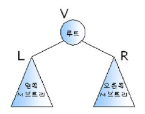
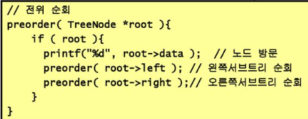
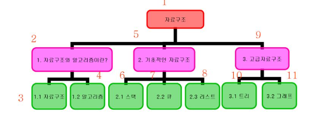
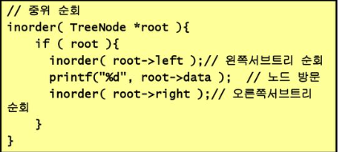
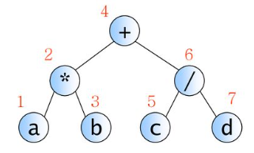
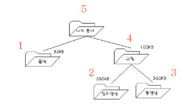
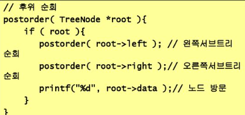

# 이진트리의 순회

## 순회(trabersal): 트리의 노드들을 체계적으로 방문하는 것

## 3가지의 기본적인 순회방법

### 전위순회(preorder trabersal) : VLR
자손노드보다 루트노드를 먼저 방문한다.\
예)정형화된 폴더구조

### 중위순회(inorder traversal) : LVR
왼쪽 자손 루트, 오른쪽 자손 순으로 방문한다.

### 후위순회(postorder traversal) : LRV
루트노드보다 자손을 먼저 방문한다.\
왼쪽자손, 오른쪽 자소느 루트 순으로 방문한다.\
예) 디렉토리 용량 조사

