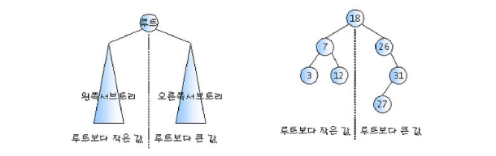
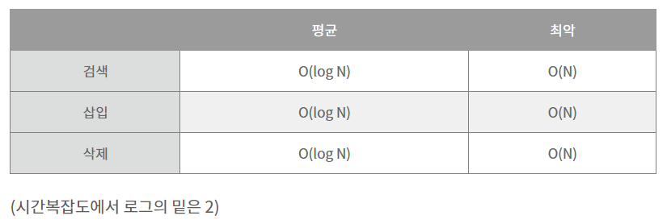

# 이진탐색트리(Binary Search Tree)

## 탐색작업을 효율적으로 하기 위한 자료구조
## 정의
### 모든 원소의 키는 유일한 키어야 한다.
### KEY(왼쪽서브트리) <= KEY(루트노드) <= KEY(오른쪽서브트리)
### 왼쪽 및 오른쪽 서브 트리도 이진탐색트리다.

## 이진탐색트리를 중위순회하면 오름차순으로 정렬된 값을 얻을 수 있다.

탐색은 프로그램에서 가장 시간이 많이 걸리는 연산 중 하나이기에 효율적인 탐색을 구현하는 것은 굉장히 중요하다.\
선형적인 구조는 탐색 연산시 일일이 순차적으로 접근하여 데이터를 찾는 방식으로 탐색을 진행해야 하기에 탐색에 비효율적이다.

다음과 같이 배열과 연결리스트 모두 앞에서부터 순차적으로 탐색해야 값을 찾을 수 있고 최악의 경우 해당 값이 맨 마지막에 있다면 O(n)의 시간복잡도를 갖는다.\
이러한 선형적인 구조의 탐색 비효율성은 데이터의 크기가 증가할수록 선형적으로 증가한다.

이러한 선형구조가 갖는 탐색의 비효율성을 개선한 것이 바로 이진 탐색 트리(Binary Search Tree)이다. 
배열을 예시로 값이 100개 있는 경우 최고는 1번에 최악은 100번 탐색을 진행해 평균 50번 빅 오 표기법으로는 평균 O(N)의 시간 복잡도를 갖는다.
이진 탐색 트리는 술게임 중 하나인 up-down과 유사하다. 
특정 값을 찾고자 한다면 루트 노드부터 시작해서 찾고자 하는 값이 더 크면 오른쪽 노드로 더 작으면 왼쪽 노드로 접근한다.
이진 탐색 트리는 노드가 100개 있는 경우 평균적으로 6~7번의 탐색을 거치며 빅 오 표기법으로 평균 O(logN) (밑이 2인)의 시간 복잡도를 갖는다.

이진 탐색 트리는 계층적 구조를 갖는 이진 트리를 기반으로 한 자료구조로 부모 노드 기준 값이 작으면 왼쪽 노드로, 값이 크면 오른쪽 노드로 위치하는 트리이다. 
하나의 노드는 값을 저장하는 key 변수와 자식 노드를 저장하는 left, right 참조 변수를 갖고 있다.
이진 탐색 트리는 언제라 '루트 노드'라는 높이가 0인 노드부터 접근하여 자식 노드들로 접근한다. 

이진 탐색 트리는 탐색에서 여전히 최악의 경우 O(n)의 시간복잡도를 갖지만 평균적으로 O(log2N)의 시간복잡도를 보인다.

최악의 경우는 정렬된 값을 순서대로 삽입하는 경우이다. 
이러한 경우 그림과 같이 리스트 형태가 되기에 이진 탐색 트리의 정의에는 부합하지만 사실상 선형적인 구조의 리스트 형태를 갖게 돼 이진 탐색 트리의 장점을 제대로 활용하지 못한다. 
이처럼 이진 탐색 트리는 삽입 순서에 따라 형태가 달라진다는 단점을 가지고 있으며 이를 극복한 자료구조는 AVL 트리이다.
AVL 트리는 삽입 순서에 상관 없이 균형을 유지하는 트리이다.