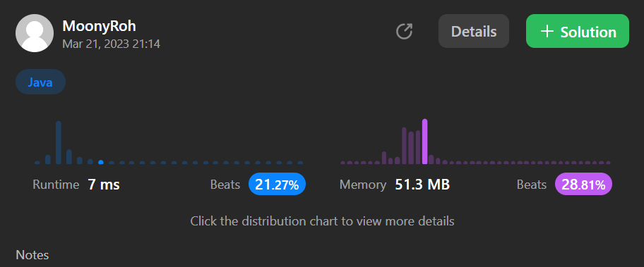

```java
package algorithm.leetcode.NumberOfIslands;

import org.junit.jupiter.api.Assertions;
import org.junit.jupiter.api.Test;

class Solution {
    /**
     * Input: grid = [
     *   ['1','1','1','1','0'],
     *   ['1','1','0','1','0'],
     *   ['1','1','0','0','0'],
     *   ['0','0','0','0','0']
     * ]
     * Output: 1
     * */

    @Test
    void numIslands_test(){
        char [][]grid = {
                {'1', '1', '1', '1', '0'},
                {'1', '1', '0', '1', '0'},
                {'1', '1', '0', '0', '0'},
                {'0', '0', '0', '0', '0'}
      };

       int answer = numIslands(grid);
        Assertions.assertEquals(1,answer);

    }

    public int numIslands(char[][] grid) {
        int numIslands = 0; // 섬의 갯수
        for (int i = 0; i < grid.length; i++) { // 1차 배열
            System.out.println(grid[i]);
            for (int j = 0; j < grid[i].length; j++) { // 2차배열
                if (grid[i][j] == '1') { //1이면 싹다 조져~
                    numIslands += isIsland(grid, i, j);
                }
            }
        }
        return numIslands;
    }

    private int isIsland(char[][] grid, int i, int j){
         //i가 0보다 작으면 지도 맨 위를 뚫고 간거임.
         //i가 그리드 길이 이상이면 아래를 뚫고 간거임.
         //그럼 섬 아니라고 때려라
        if (i < 0 || i >= grid.length) {
            return 0;
        }

        // j가 0보다 작으면 왼쪽으로 뚫고 나간다.
        // j가 그리드 열 길이보다 이상이면 오른쪽으로 뚫고 나간거다.
        if (j < 0 || j >= grid[i].length) {
            return 0;
        }
        // 혹시.. 물은 아니지?
        if (grid[i][j] == '0') {
            return 0;
        }

        // 방문한 육지('1')를 물('0')로 봐야 아니라고본다.
        grid[i][j] = '0';
        isIsland(grid,i-1,j); //위 탐색
        isIsland(grid,i+1,j); //아래 탐색
        isIsland(grid,i,j-1); //왼쪽 탐색
        isIsland(grid,i,j+1); //오른쪽 탐색

        return 1;
    }
}


```

```java
class BinarySearchTree {
    TreeNode root;

    void insert(int value) {
        if (root == null) {
            root = new TreeNode(value);
        } else {
            TreeNode current = root;
            while (true) {
                if (value < current.value) {
                    if (current.left == null) {
                        current.left = new TreeNode(value);
                        break;
                    }
                    current = current.left;
                } else {
                    if (current.right == null) {
                        current.right = new TreeNode(value);
                        break;
                    }
                    current = current.right;
                }
            }
        }
    }
}
```

이진 자료저리                                                                                                                                                                                                                                                                                                                                                                                                                                                                                                                                                                                                                                                                                                                                                                                                                                                                                                                                                                                                                                                                                                                                                                                                                                                                                                                                                                                                                                                                                                                                                                                                                                                                                                                                                                                                                                                                                                                                                                                                                                                                                                                                                                                           3ㅇㅇㅇㅅ