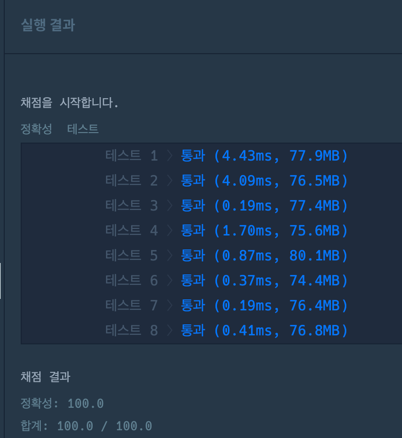

~~~java
class Solution {
    int target = 0;
    int count = 0;

    public int solution(int[] numbers, int target) {
        int answer = 0;
        this.target = target;

        search(numbers, 0, 0);

        return this.count;
    }

    public void search(int[] nums, int index, int sum){

        if (index == nums.length) {

            if (target == sum) this.count++;

            return;
        }

        int current = nums[index];
        int plus = sum + current;
        int minus = sum - current;

        search(nums, index + 1, plus);
        search(nums, index + 1, minus);
    }
}
~~~