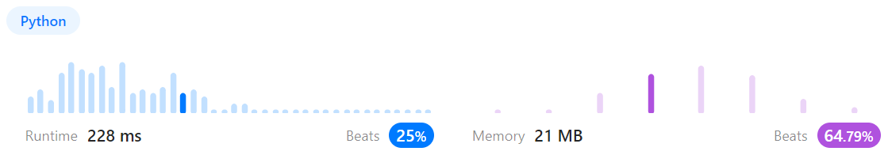
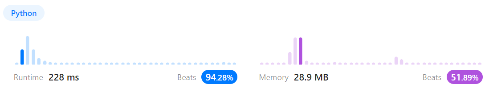
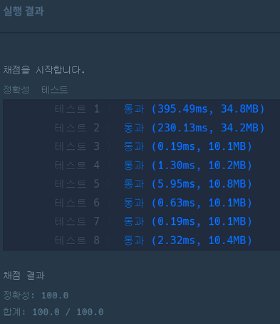
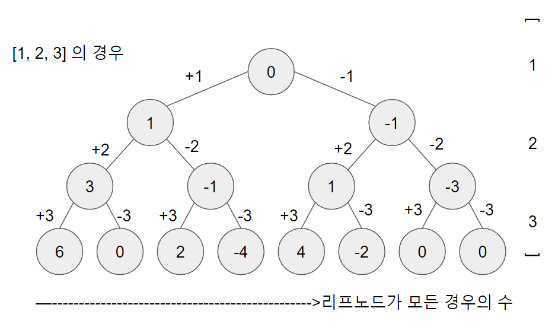

# 문제풀이
## 1302. Deepest Leaves Sum

### Discription  
루트 노드가 주어졌을 때, 가장 깊이가 깊은 리프 노드들의 값의 합을 구하라  
https://leetcode.com/problems/deepest-leaves-sum/submissions/919510500/  

### Solution

```python
# Definition for a binary tree node.
# class TreeNode(object):
#     def __init__(self, val=0, left=None, right=None):
#         self.val = val
#         self.left = left
#         self.right = right
class Solution(object):
    def __init__(self):
        self.out = 0

    def deepestLeavesSum(self, root):
        """
        :type root: TreeNode
        :rtype: int
        """

        self.levelorder(root)
        return self.out

    def levelorder(self, node):
        queue = []
        queue.append(node)
        while queue:
            self.out = 0
            for _ in range(len(queue)):
                temp = queue.pop(0)
                self.out += temp.val
                if temp.left:
                    queue.append(temp.left)
                if temp.right:
                    queue.append(temp.right)
```
  
root 노드부터 한 층씩 합을 구한다  
매 층마다 out 값을 초기화하며 마지막 층까지 구한다  
마지막 층의 합을 구했으면 out을 return 한다  

위의 코드는 List 자료구조를 이용해서 속도가 느리게 나왔는데  
pop(0) 실행시 모든 요소의 인덱스를 한칸씩 앞으로 밀어줘야 하기 때문에  
deque를 사용해서 popleft 하면 더 빨라진다고 한다  

# 문제풀이
## 200. Number of Islands

### Discription  
요약)  
섬("1")과 물("0")로 이루어진 m x n 크기의 2차원 배열이 주어졌을 때  
물로 둘러쌓인 섬은 총 몇 개인지 구하라  
https://leetcode.com/problems/number-of-islands/submissions/919544200/  

### Solution

```python
class Solution(object):
    def __init__(self):
        self.m = 0
        self.n = 0

    def numIslands(self, grid):
        """
        :type grid: List[List[str]]
        :rtype: int
        """
        island = 0
        self.m = len(grid)
        self.n = len(grid[0])
        
        for y in range(self.m):
            for x in range(self.n):
                if grid[y][x] == "1":
                    self.floodfill(y, x, grid)
                    island += 1

        return island

    def floodfill(self, y, x, gmap):
        if (y < 0 or y >= self.m) or (x < 0 or x >= self.n):
            return

        if gmap[y][x] == "0":
            return 
        
        gmap[y][x] = "0"
        self.floodfill(y-1, x, gmap) # 상
        self.floodfill(y+1, x, gmap) # 하
        self.floodfill(y, x-1, gmap) # 좌
        self.floodfill(y, x+1, gmap) # 우
```
  
2중 for문을 돌리며 모든 원소를 순회하다가  
"1"을 만나면 거기서부터 floodfill 알고리즘을 실행시킨다  
floodfill 알고리즘 수행시 visited는 별도로 표기하지 않고 원본 배열에서 "0"으로 만드는 방법으로 이미 찾은 섬은 다시 찾지 않도록 한다  
(찾았으면 지도에서 지워버린다고 생각하면 된다)  
floodfill 알고리즘은 dfs 방식으로 구현했다. bfs방식으로 구현해도 상관 없다.  
섬을 찾을 때 마다 카운트를 증가시키고, 모든 배열 순회를 완료하면(배열의 모든 요소가 "0"이 된다) 카운트를 반환한다  

## 타겟 넘버

### 문제 설명
요약)  
양의 정수 넘버 리스트와 타겟 넘버가 주어졌을 때  
넘버 리스트의 각 요소를 더하거나 빼서 타겟 넘버가 나오는 경우의 수를 구하라  
https://school.programmers.co.kr/learn/courses/30/lessons/43165  

### Solution

```python
from collections import deque

def solution(numbers, target):
    answer = 0
    leaves = deque([0])
    
    while numbers:
        num = numbers.pop() # 속도 문제로 뒤에서부터 꺼냄
        for _ in range(len(leaves)):
            leaf = leaves.popleft()
            leaves.append(leaf + num)
            leaves.append(leaf - num)
            
    for val in leaves:
        if val == target:
            answer += 1
    
    return answer
```
  
  

0을 루트노드로 둔 뒤  
numbers에서 숫자를 하나씩 꺼내며 말단 노드의 left에는 +를, right는 -시킨 노드를 추가시킨다  
이를 BFS 방식으로 반복시켜 트리를 만들면  
말단 노드가 만들 수 있는 모든 경우의 수가 된다.  
모든 경우의 수 중에서 target과 같은 것의 개수를 반환시킨다  

위 코드에서는 List를 그냥 사용할 시 속도 문제로 테스트1, 테스트2를 통과하지 못해  
deque를 사용해서 구현했다  

