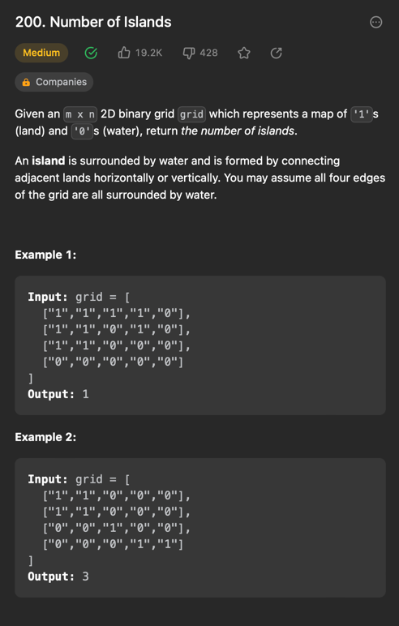
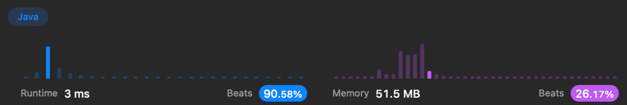

```java
class Solution {
public int numIslands(char[][] grid) {
// DFS로 풀것, 스택 또는 재귀함수로 구현
int answer = 0;

        for(int i = 0; i<grid.length; i++){
          for(int j = 0; j < grid[0].length; j++){
            if(grid[i][j] == '1' ){
              changeWater(grid,i,j);
               answer++;
            }
          }
        }
        return answer;
    }

    public void changeWater(char[][] grid, int i, int j){
      if(grid[i][j] == '1') {
        grid[i][j] = '0';

        if (i > 0) {
          changeWater(grid, i - 1, j);
        }
        if (j > 0) {
          changeWater(grid, i, j - 1);
        }
        if (i < grid.length - 1) { //4
          changeWater(grid, i + 1, j);
        }
        if (j < grid[i].length - 1) {
          changeWater(grid, i, j + 1);
        }
      }
    }
}


