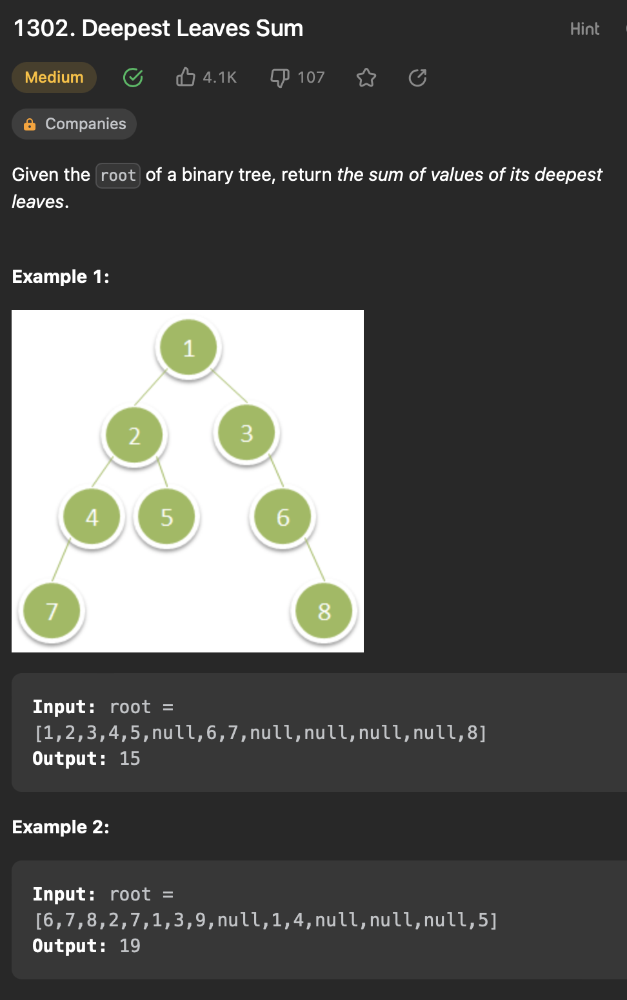

## LeetCode - deepest leaves sum

### 문제


###코드
```java
class Solution {
    TreeNode left,right;
    
    public int deepestLeavesSum(TreeNode root) {
        Queue<TreeNode> queue = new LinkedList();
        queue.offer(root);

        int levelSum = 0;

        while(!queue.isEmpty()) {
            levelSum = 0;
            int size = queue.size();
            
            for(int i = 0; i<size; i++){
                TreeNode curruntNode = queue.poll();
                levelSum += curruntNode.val;
                if(curruntNode.left != null) queue.offer(curruntNode.left);
                if(curruntNode.right != null) queue.offer(curruntNode.right);
            }
        }
        return levelSum;
    }
}

```
### 결과
