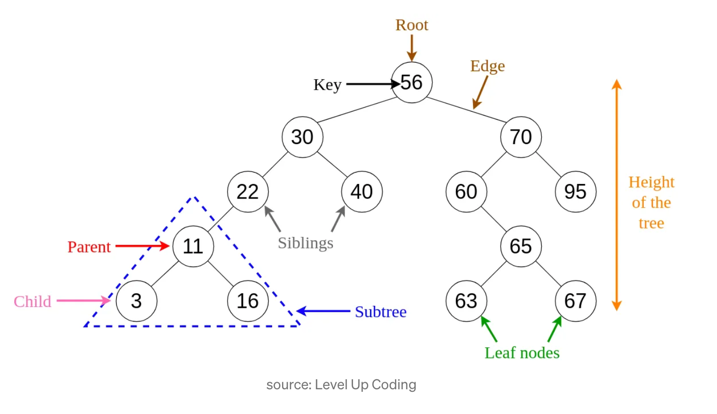

## 이진탐색트리


- 중복이 허용되지 않는 정렬된 이진트리
- 루트노드의 왼쪽노드는 루트노드보다 작아야함.
- 루트노드의 오른쪽노드는 루트노드보다 커야함.
- 시간복잡도 : O(log2n)
```java
/**
* Node Class
*
* @author kimtaeng
  */
  class Node {
  int value;
  Node leftChild;
  Node rightChild;

  public Node(int value) {
    this.value = value;
    this.leftChild = null;
    this.rightChild = null;
    }
  }


/**
 * Binary Search Tree
 *
 * @author kimtaeng
 */
class BinaryTree {
  Node rootNode = null;

  /**
   * 새로운 노드 삽입
   */
  public void insertNode(int element) {

    /*
     * 루트가 빈 경우, 즉 아무 노드도 없는 경우
     */
    if (rootNode == null) {
      rootNode = new Node(element);
    } else {
      Node head = rootNode;
      Node currentNode;

      while (true) {
        currentNode = head;

        /*
         * 현재의 루트보다 작은 경우, 왼쪽으로 탐색을 한다.
         */
        if (head.value > element) {
          head = head.leftChild;

          /*
           * 왼쪽 자식 노드가 비어있는 경우, 해당 위치에 추가할 노드를 삽입한다.
           * 현재 currenNode head를 가리키고 있다.
           */
          if (head == null) {
            currentNode.leftChild = new Node(element);
            break;
          }
        } else {
          /*
           * 현재의 루트보다 큰 경우, 오른쪽으로 탐색을 한다.
           */
          head = head.rightChild;

          /*
           * 오른쪽 자식 노드가 비어있는 경우, 해당 위치에 추가할 노드를 삽입한다.
           * 현재 currenNode head를 가리키고 있다.
           */
          if (head == null) {
            currentNode.rightChild = new Node(element);
            break;
          }
        }
      }
    }
  }

  /**
   * 특정 노드 삭제
   */
  public boolean removeNode(int element) {
    Node removeNode = rootNode;
    Node parentOfRemoveNode = null;

    while (removeNode.value != element) {
      parentOfRemoveNode = removeNode;

      /* 삭제할 값이 현재 노드보다 작으면 왼쪽을 탐색한다. */
      if (removeNode.value > element) {
        removeNode = removeNode.leftChild;
      } else {
        removeNode = removeNode.rightChild;
      }

      /*
       * 값 대소를 비교하며 탐색했을 때
       * 잎 노드(Leaf node)인 경우 삭제를 위한 탐색 실패
       */
      if (removeNode == null)
        return false;

    }

    /* 자식 노드가 모두 없을 때 */
    if (removeNode.leftChild == null && removeNode.rightChild == null) {
      /* 삭제 대상이 트리의 루트일 때 */
      if (removeNode == rootNode) {
        rootNode = null;
      } else if (removeNode == parentOfRemoveNode.rightChild) {
        parentOfRemoveNode.rightChild = null;
      } else {
        parentOfRemoveNode.leftChild = null;
      }
    }

    /* 오른쪽 자식 노드만 존재하는 경우 */
    else if (removeNode.leftChild == null) {
      if (removeNode == rootNode) {
        rootNode = removeNode.rightChild;
      } else if (removeNode == parentOfRemoveNode.rightChild) {
        /*
         * 삭제 대상의 오른쪽 자식 노드를 삭제 대상 위치에 둔다.
         */
        parentOfRemoveNode.rightChild = removeNode.rightChild;
      } else {
        parentOfRemoveNode.leftChild = removeNode.rightChild;
      }
    }

    /* 왼쪽 자식 노드만 존재하는 경우 */
    else if (removeNode.rightChild == null) {
      if (removeNode == rootNode) {
        rootNode = removeNode.leftChild;
      } else if (removeNode == parentOfRemoveNode.rightChild) {
        parentOfRemoveNode.rightChild = removeNode.leftChild;
      } else {
        /*
         * 삭제 대상의 왼쪽 자식을 삭제 대상 위치에 둔다.
         */
        parentOfRemoveNode.leftChild = removeNode.leftChild;
      }
    }

    /*
     * 두 개의 자식 노드가 존재하는 경우
     * 삭제할 노드의 왼쪽 서브 트리에 있는 가장 큰 값 노드를 올리거나
     * 오른쪽 서브 트리에 있는 가장 작은 값 노드를 올리면 된다.
     * 구현 코드는 2번째 방법을 사용한다.
     */
    else {
      /* 삭제 대상 노드의 자식 노드 중에서 대체될 노드(replaceNode)를 찾는다. */
      Node parentOfReplaceNode = removeNode;

      /* 삭제 대상의 오른쪽 서브 트리 탐색 지정 */
      Node replaceNode = parentOfReplaceNode.rightChild;

      while (replaceNode.leftChild != null) {
        /* 가장 작은 값을 찾기 위해 왼쪽 자식 노드로 탐색한다. */
        parentOfReplaceNode = replaceNode;
        replaceNode = replaceNode.leftChild;
      }

      if (replaceNode != removeNode.rightChild) {
        /* 가장 작은 값을 선택하기 때문에 대체 노드의 왼쪽 자식은 빈 노드가 된다. */
        parentOfReplaceNode.leftChild = replaceNode.rightChild;

        /* 대체할 노드의 오른쪽 자식 노드를 삭제할 노드의 오른쪽으로 지정한다. */
        replaceNode.rightChild = removeNode.rightChild;
      }

      /* 삭제할 노드가 루트 노드인 경우 대체할 노드로 바꾼다. */
      if (removeNode == rootNode) {
        rootNode = replaceNode;
      } else if (removeNode == parentOfRemoveNode.rightChild) {
        parentOfRemoveNode.rightChild = replaceNode;
      } else {
        parentOfRemoveNode.leftChild = replaceNode;
      }

      /* 삭제 대상 노드의 왼쪽 자식을 잇는다. */
      replaceNode.leftChild = removeNode.leftChild;
    }

    return true;
  }

  /**
   * 중위 순회
   */
  public void inorderTree(Node root, int depth) {
    if (root != null) {
      inorderTree(root.leftChild, depth + 1);
      for (int i = 0; i < depth; i++) {
        System.out.print("ㄴ");
      }
      System.out.println(root.value);
      inorderTree(root.rightChild, depth + 1);
    }
  }

  /**
   * 후위 순회
   */
  public void postorderTree(Node root, int depth) {
    if (root != null) {
      postorderTree(root.leftChild, depth + 1);
      postorderTree(root.rightChild, depth + 1);
      for (int i = 0; i < depth; i++) {
        System.out.print("ㄴ");
      }
      System.out.println(root.value);
    }
  }

  /**
   * 전위 순회
   */
  public void preorderTree(Node root, int depth) {
    if (root != null) {
      for (int i = 0; i < depth; i++) {
        System.out.print("ㄴ");
      }
      System.out.println(root.value);
      preorderTree(root.leftChild, depth + 1);
      preorderTree(root.rightChild, depth + 1);
    }
  }
}
```
