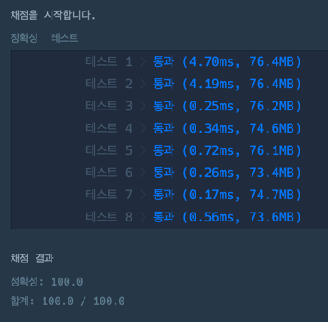

```java
class Solution {
    int answer = 0;
    
    public int solution(int[] numbers, int target) {
        int depth = 0;
        int sum = 0;

        DFS(numbers,target,depth,sum);
        return answer;
    }
    
    public void DFS(int[] numbers,int target,int depth,int sum){
        if(numbers.length == depth){
            if(sum == target) answer++;
        }else{
            DFS(numbers,target,depth+1,sum+numbers[depth]);
            DFS(numbers,target,depth+1,sum-numbers[depth]);
        }
    }
}
```

