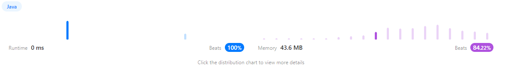

```java
/**
 * Definition for singly-linked list.
 * public class ListNode {
 *     int val;
 *     ListNode next;
 *     ListNode() {}
 *     ListNode(int val) { this.val = val; }
 *     ListNode(int val, ListNode next) { this.val = val; this.next = next; }
 * }
 */
/**
 * Definition for a binary tree node.
 * public class TreeNode {
 *     int val;
 *     TreeNode left;
 *     TreeNode right;
 *     TreeNode() {}
 *     TreeNode(int val) { this.val = val; }
 *     TreeNode(int val, TreeNode left, TreeNode right) {
 *         this.val = val;
 *         this.left = left;
 *         this.right = right;
 *     }
 * }
 */
class Solution {
    public TreeNode sortedListToBST(ListNode head) {
        if(head == null) { // 헤더값이 빈값일 때 Example 2
            return null;
        }
        if(head.next == null) { // 헤더값이 최상단 노드값만 왔을때
            return new TreeNode(head.val);
        }
        int size = 0;
        ListNode list = head;
        while(list != null){ // 지역변수 값 받기
            size++;
            list = list.next;
        }
        int[] arr = new int[size]; // 배열 초기화
        list = head; // 배열에 값을 넣기 위한 세팅
        for(int i = 0; i < size; i++){ // 배열에 리스트 값 넣기
            arr[i] = list.val;
            list= list.next;
        }
        return bst(arr,0,size-1);

    }

    public TreeNode bst(int[] array, int left, int right) { // bst가 맞는지는 모르겠음
        if (left > right) {
            return null;
        }

        int middle = (right - left) / 2 + left;

        TreeNode tree = new TreeNode(array[middle]);

        tree.left = bst(array, left, middle - 1);
        tree.right = bst(array, middle + 1, right);

        return tree;
    }
}
```

