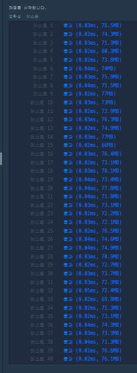
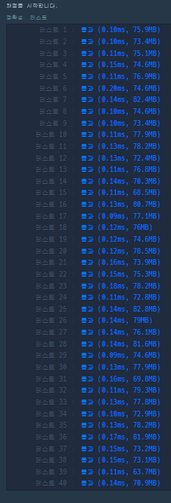

```java
class Solution { 
    //5의 5제곱 + 5의 4제곱 + 5의 3제곱 + 5의 2제곱 + 5 = 3125+625+125+25+5 = 3905
    public int solution(String word) {
        int answer = 0;
        int total= 3905;
        
        char alphabets[] = {'A', 'E', 'I', 'O', 'U'};
        
        for(int i=0; i<word.length(); i++){
            total = (total)/5;
            for(int j=0; j<5; j++){
                if(alphabets[j] == word.charAt(i)){
                    answer += 1 + j * total;
                }
            }
        }
        
        return answer;
    }
}
```



```java
import java.util.HashMap;
class Solution { 
    //5의 5제곱 + 5의 4제곱 + 5의 3제곱 + 5의 2제곱 + 5 = 3125+625+125+25+5 = 3905
    public int solution(String word) {
        int answer = 0;
        int total= 3905;
        int mapValue = 0;
        
        HashMap<Character, Integer> map = new HashMap<Character, Integer>();
        map.put('A', 0);
        map.put('E', 1);
        map.put('I', 2);
        map.put('O', 3);
        map.put('U', 4);
        
        for(int i=0; i<word.length(); i++){
            total = (total)/5;
            mapValue = map.get(word.charAt(i));
            answer += 1 + mapValue * total;
        }
        
        return answer;
    }
}
```
