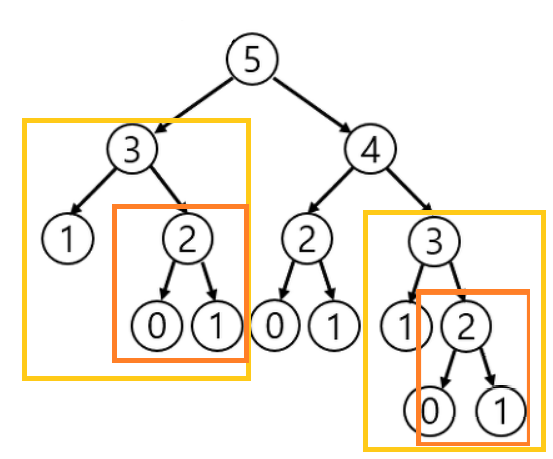
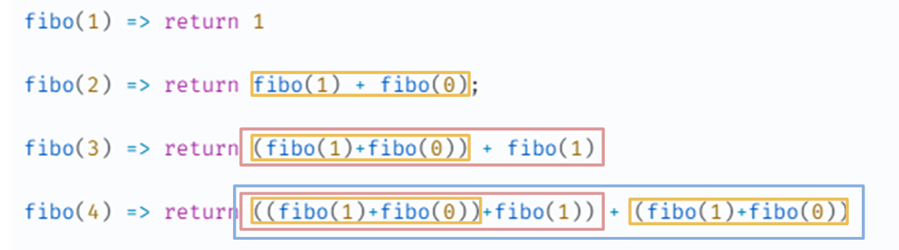

# 재귀 함수
함수 안에서 함수 자기자신을 호출하는 방식\
재귀 함수는 반복적인 처리를 위해 사용한다.

재귀 호출을 사용하려면 반드시 종료 조건이 있어야한다.\
탈출 조건(종료 조건)이 존재하지 않는다면, 함수한 무한 호출되어 stack overflow(스택 오버플로) 에러가 발생한다.\

## 재귀 함수 장점
기존 반복문에 비해 코드를 효율적으로 짤 수 있다.

ex) 피보나치 수열 

[백준] 피보나치 수 5(10870)\
https://www.acmicpc.net/problem/10870####

반복문
```java
import java.util.Scanner;

public class Main {
    public static void main(String[] args) {
        Scanner in = new Scanner(System.in);
        int N = in.nextInt();
        System.out.println(fibo(N));//런타임에러....
    }

    // 피보나치 함수
    public static int fibo(int n) {
        // 수열을 담을 배열 선언 (0번째엔 0이 들어가니 입력받은 값의 피보나치 수를 출력하려면 +1 해줘야 함)
        int[] arr = new int[n+1];
        arr[0] = 0;
        if(n > 0) {
            arr[1] = 1;
        }
        // 피보나치 수열을 만드는 반복문
        for (int i=2; i<arr.length; i++) {
            arr[i] = arr[i - 1] + arr[i - 2];
        }
        return arr[n];
    }
}
```
재귀
```java
import java.util.Scanner;

public class Main {
    public static void main(String[] args) {
        Scanner in = new Scanner(System.in);
        int N = in.nextInt();
        System.out.println(fibo(N));
    }

    // 피보나치 함수
    public static int fibo(int N) {
        if (N == 0)	return 0;
        if (N == 1)	return 1;
        return fibo(N - 1) + fibo(N - 2);
    }
}
```
## 재귀 함수의 단점
연산이 느리다(많은 연산 필요)





위와 같이 이미 구한 fibo(1), fibo(0) 이더라도 계속해서 연산에 해당 과정이 들어간다.
따라서 피보나치의 경우 n이 클수록, 중복되는 수가 많아지고, 연산도 기하급수적으로 늘어나게 된다.