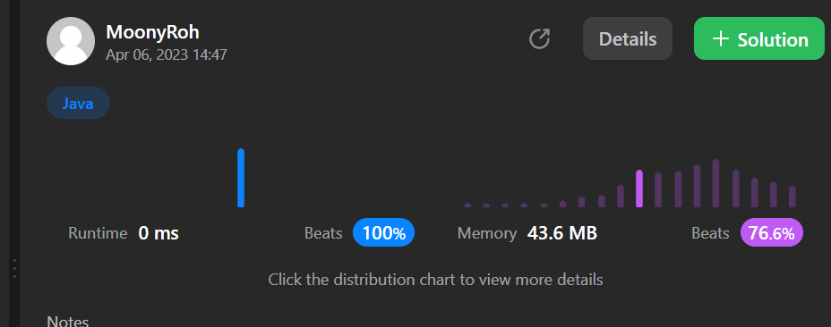

```java
class Solution {

    @Test
    public void solution_test() {
        ListNode head = new ListNode(-10);
        head.next = new ListNode(-3);
        head.next.next = new ListNode(0);
        head.next.next.next = new ListNode(5);
        head.next.next.next.next = new ListNode(9);

        Solution solution = new Solution();
        TreeNode root = solution.sortedListToBST(head);

        System.out.println("In-order traversal of the converted BST:");
        printInOrder(root);
    }


    public TreeNode sortedListToBST(ListNode head) {
        // - head가 null이면 빈 트리를 반환.
        if (head == null) {
            return null;
        }

        // - head 다음이 null이면, 트리에 노드가 하나만 있는 경우입니다.
        if (head.next == null) {
            return new TreeNode(head.val);
        }

        // slow 포인터와 fast 포인터를 사용하여 리스트의 중간 노드를 찾습니다.
        ListNode slow = head;
        ListNode fast = head;
        ListNode prev = null; // prev는 slow 포인터의 이전 노드를 추적합니다.

        // 리스트의 중간 노드를 찾습니다.
        // fast 포인터가 끝에 도달할 때까지 slow 포인터와 fast 포인터를 이동시킵니다.
        while (fast != null && fast.next != null) {
            prev = slow;          // prev는 slow 포인터의 이전 노드를 추적합니다.
            slow = slow.next;     // slow 포인터는 한 칸씩 이동합니다.
            fast = fast.next.next; // fast 포인터는 두 칸씩 이동합니다.
        }

        // 중간 노드를 루트로 사용합니다.
        TreeNode root = new TreeNode(slow.val);

        // 중간 노드의 왼쪽과 오른쪽 부분을 각각 왼쪽과 오른쪽 서브트리로 변환합니다.
        if (prev != null) {
            prev.next = null; // prev의 다음을 null로 설정하여 중간 노드를 기준으로 리스트를 분리합니다.
            root.left = sortedListToBST(head);     // 왼쪽 부분을 재귀적으로 변환합니다.
            root.right = sortedListToBST(slow.next); // 오른쪽 부분을 재귀적으로 변환합니다.
        }

        return root;
    }

class TreeNode {
    int val;
    TreeNode left;
    TreeNode right;

    TreeNode() {
    }

    TreeNode(int val) {
        this.val = val;
    }

    TreeNode(int val, TreeNode left, TreeNode right) {
        this.val = val;
        this.left = left;
        this.right = right;
    }
}

class ListNode {
    int val;
    ListNode next;

    ListNode() {
    }

    ListNode(int val) {
        this.val = val;
    }

    ListNode(int val, ListNode next) {
        this.val = val;
        this.next = next;
    }
}

public class TestSortedLinkedListToBST {
    public static void printInOrder(TreeNode node) {
        if (node == null) {
            return;
        }

        printInOrder(node.left);
        System.out.print(node.val + " ");
        printInOrder(node.right);
    }

}
```
### slow 와 fast가 두칸 차이나는 이유는?

- slow와 fast 포인터가 각각 한 칸과 두 칸씩 이동하는 이유는 연결 리스트의 중간 노드를 찾기 위함.

- slow 포인터는 한 칸씩 이동하고, fast 포인터는 두 칸씩 이동.  
따라서, fast 포인터가 리스트의 끝에 도달했을 때, slow 포인터는 리스트의 중간 노드에 위치한다.
- 이 방법을 통해 리스트의 길이를 미리 알지 못해도 중간 노드를 찾을 수 있다.
  -----
- 예시
  - 예를 들어, 아래와 같은 연결 리스트가 있다  

```
1 -> 2 -> 3 -> 4 -> 5 -> 6 -> 7
```
- slow와 fast 포인터가 각각 한 칸과 두 칸씩 이동하는 과정은 다음과 같다.
```java
1 -> 2 -> 3 -> 4 -> 5 -> 6 -> 7
S         F

1 -> 2 -> 3 -> 4 -> 5 -> 6 -> 7
      S         F

1 -> 2 -> 3 -> 4 -> 5 -> 6 -> 7
            S               F
```
- fast 포인터가 리스트의 끝에 도달했다.
- 이 시점에서 slow 포인터는 값이 4인 중간 노드에 위치해 있다.
- 이를 이용해 중간 노드를 찾고, 높이 균형 이진 탐색 트리를 구성할 수 있다.


