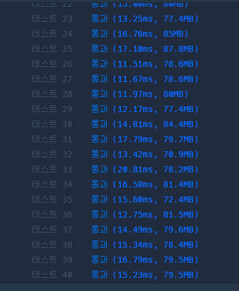
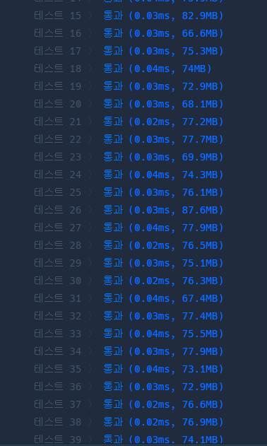

```java
class Solution {
  int count = 0; // 생성된 단어의 개수를 세기 위한 변수
  int answer = 0; // 목표 단어의 순서를 저장할 변수

  public int solution(String word) {
    generateWords("", 0, word); // 단어 생성 시작
    return answer; // 목표 단어의 순서 반환
  }

  // 재귀적으로 단어를 생성하는 함수
  private void generateWords(String current, int depth, String target) {
    if (depth == 5) { // 깊이가 5에 도달하면 생성을 중지
      return;
    }

    // 모음을 순회하면서 단어를 생성
    for (char c : new char[] {'A', 'E', 'I', 'O', 'U'}) {
      String newWord = current + c; // 현재 문자열에 모음을 추가
      count++; // 단어 개수를 증가시킴

      // 생성된 단어가 목표 단어와 같으면
      if (newWord.equals(target)) {
        answer = count; // 현재까지의 단어 개수를 정답에 저장
        return;
      }

      // 다음 모음을 추가하여 재귀적으로 단어 생성
      generateWords(newWord, depth + 1, target);
    }
  }
}
```


```java
class Solution {
    public int solution(String word) {
        int answer = 0;
        // 각 자릿수별로 경우의 수를 나타내는 계수 배열
        int[] multipliers = {781, 156, 31, 6, 1};
        char[] vowels = {'A', 'E', 'I', 'O', 'U'};
        int value;

        // 각 문자별로 경우의 수를 누적해서 더함
        for (int i = 0; i < word.length(); i++) {
            char c = word.charAt(i);
            value = 0;
            // 해당 문자가 몇 번째 모음인지 찾음
            for (int j = 0; j < vowels.length; j++) {
                if (c == vowels[j]) {
                    value = j;
                    break;
                }
            }
            // 해당 문자의 위치에 따른 경우의 수를 계산하고 누적
            answer += value * multipliers[i] + 1;
        }

        return answer;
    }
}
```


```java

import org.junit.jupiter.api.Test;
import static org.junit.jupiter.api.Assertions.assertEquals;

class SolutionTest {
    private final Solution solution = new Solution();

    @Test
    void testSolution() {
        assertEquals(6, solution.solution("AAAAE"));
        assertEquals(10, solution.solution("AAAE"));
        assertEquals(1563, solution.solution("I"));
        assertEquals(1189, solution.solution("EIO"));
    }
}

```
- 각 자리에는 5개의 문자('A', 'E', 'I', 'O', 'U') 중 하나가 올 수 있으며, 단어의 최대 길이는 5입니다.

- 첫 번째 자리:

  - 첫 번째 자리가 변경되는 경우는 다른 자리의 모든 경우의 수를 고려해야 합니다.
  - 두 번째 자리에는 5개의 문자가 올 수 있고, 세 번째 자리에도 5개의 문자가 올 수 있으며, 이와 같이 다섯 번째 자리까지 모두 같은 원리로 동작합니다.
  따라서 첫 번째 자리의 계수는 5^4 + 5^3 + 5^2 + 5^1 + 5^0 = 781입니다.
  두 번째 자리:

두 번째 자리가 변경되는 경우는 세 번째 자리부터 다섯 번째 자리까지의 모든 경우의 수를 고려해야 합니다.
따라서 두 번째 자리의 계수는 5^3 + 5^2 + 5^1 + 5^0 = 156입니다.
세 번째 자리:

세 번째 자리가 변경되는 경우는 네 번째 자리부터 다섯 번째 자리까지의 모든 경우의 수를 고려해야 합니다.
따라서 세 번째 자리의 계수는 5^2 + 5^1 + 5^0 = 31입니다.
네 번째 자리:

네 번째 자리가 변경되는 경우는 다섯 번째 자리의 모든 경우의 수를 고려해야 합니다.
따라서 네 번째 자리의 계수는 5^1 + 5^0 = 6입니다.


다섯 번째 자리:

다섯 번째 자리가 변경되는 경우는 자기 자신만을 고려하면 ..f
따라서 다섯 번째 자리의 계수는 5^0 = 1.
위 근거를 바탕으로 자리수별 계수 배열을 [781, 156, 31, 6, 1]로 설정한 것.