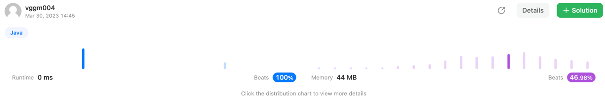

~~~java
/**
 * Definition for singly-linked list.
 * public class ListNode {
 *     int val;
 *     ListNode next;
 *     ListNode() {}
 *     ListNode(int val) { this.val = val; }
 *     ListNode(int val, ListNode next) { this.val = val; this.next = next; }
 * }
 */
/**
 * Definition for a binary tree node.
 * public class TreeNode {
 *     int val;
 *     TreeNode left;
 *     TreeNode right;
 *     TreeNode() {}
 *     TreeNode(int val) { this.val = val; }
 *     TreeNode(int val, TreeNode left, TreeNode right) {
 *         this.val = val;
 *         this.left = left;
 *         this.right = right;
 *     }
 * }
 */
class Solution {
    private ListNode node;
    
    public TreeNode sortedListToBST(ListNode head) {
        int size = 0;
        ListNode temp = head;
        node = head;
        
        while (temp != null) {
            temp = temp.next;
            size++;
        }

        return inOrder(0, size - 1);
    }

    public TreeNode inOrder(int start, int end) {
        if(start > end) return null;

        int mid = start + (end - start) / 2;

        TreeNode left = inOrder(start, mid - 1);
        TreeNode resultNode = new TreeNode(node.val);
        resultNode.left = left;
        node = node.next;

        TreeNode right = inOrder(mid + 1, end);
        resultNode.right = right;
        
        return resultNode;
    }
}
~~~