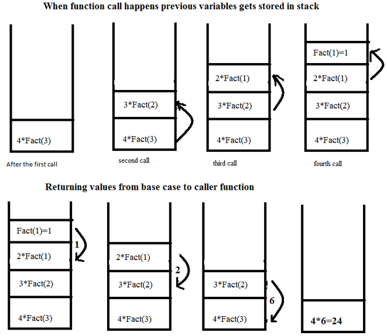

# 재귀함수
  
## 재귀함수란?
함수 내부에 자기 자신을 다시 호출하는 로직이 있는 함수 구조.  
반드시 재귀를 탈출하는 조건문을 포함해야 한다. (없을 시 무한 반복 호출)  

## 재귀함수의 장단점
### 재귀함수의 장점
* 직관적으로 이해하기 쉬운 코드를 작성할 수 있다.

```python
# 피보나치 수열 구현 비교
# 재귀를 사용하지 않은 경우
def fib(n):
    a = 1
    b = 1
    if n==1 or n==2:
        return 1
        
    for i in range(1, n):
        t = a + b
        a = b
        b = t

    return a

# 재귀를 사용한 경우
def fib(n):
    if n==1 or n==2:
        return 1
    else:
        return fib(n-1) + fib(n-2)
```

### 재귀함수의 단점
* 재귀를 반복할 때 마다 함수를 다시 호출하기 때문에 메모리 공간을 많이 사용한다.  
* 알고리즘에 대한 이해가 부족할 경우 코드 분석이 더 어려워질 수 있다.  

### 대표적인 재귀 알고리즘
* 피보나치 수열
* 팩토리얼 계산
* 유클리드 호제법(최대공약수 구하기, GCD)
* 구구단 계산
* 하노이의 탑
* DFS 호출

등등...

## 재귀 함수 호출 스택
  
재귀 함수를 실행할 때, 재귀 호출을 실행하면 이전 함수가 메모리에 남아있는 상태로 다음 함수가 실행된다.  
이렇게 호출된 함수는 Stack 형태로 메모리에 쌓인다(FILO).  
이를 반복하면 최종적으로 재귀를 탈출할 때 까지 호출된 모든 함수가 메모리상에 남아있게 된다.  
이 때문에 재귀함수가 메모리를 많이 소모하게 된다.  

## 꼬리재귀
  
재귀함수의 return 구문에서 연산을 제거할 시 메모리 사용량을 절약할 수 있다.  
```python
# 꼬리재귀를 사용하지 않은 경우
def factorial(n):
    if n==1:
        return 1
    
    return n * factorial(n-1)

# 꼬리재귀를 사용한 경우
def factorial(n, total):
    if n==1:
        return 1
    
    return factorial(n-1, n * total)
```
