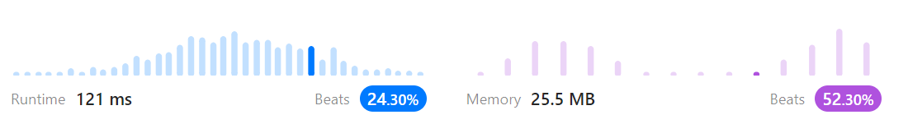
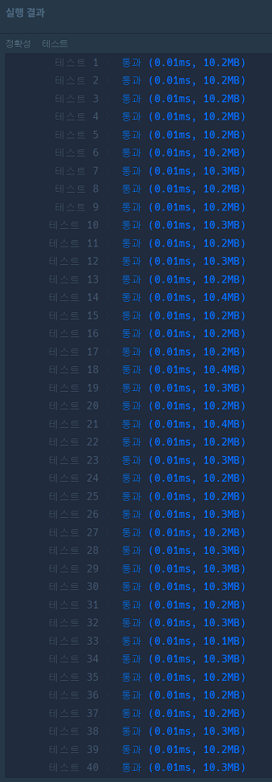

# 문제풀이
## 109. Convert Sorted List to Binary Search Tree

### Discription  
요약) Sorted List를 height-balanced Binary Search Tree로 만들어라  
https://leetcode.com/problems/convert-sorted-list-to-binary-search-tree/description/  

### Solution

```python
# Definition for singly-linked list.
# class ListNode(object):
#     def __init__(self, val=0, next=None):
#         self.val = val
#         self.next = next
# Definition for a binary tree node.
# class TreeNode(object):
#     def __init__(self, val=0, left=None, right=None):
#         self.val = val
#         self.left = left
#         self.right = right
class Solution(object):
    def sortedListToBST(self, head):
        """
        :type head: Optional[ListNode]
        :rtype: Optional[TreeNode]
        """
        if not head:
            return None

        if not head.next:
            return TreeNode(head.val)
        
        node_list = []
        while head:
            node_list.append(TreeNode(head.val))
            head = head.next
        
        return self.create_bst(node_list)
        

    def create_bst(self, node_list):
        node_len = len(node_list)

        if node_len == 0:
            return None

        mid = node_len // 2
        root_node = node_list[mid]

        root_node.left = self.create_bst(node_list[:mid])
        root_node.right = self.create_bst(node_list[mid+1:])

        return root_node

```
  
노드 리스트를 배열에 모두 넣어버린 뒤  
가운데 위치 노드를 root로 두고 왼쪽 노드 리스트와 오른쪽 노드 리스트로 나눈다  
나눠진 서브트리의 가운데 위치 값을 다시 서브트리의 root로 둔다  
이를 반복한다  

## 모음 사전

### 문제 설명
요약)  
'A', 'E', 'I', 'O', 'U' 다섯 글자로 만들 수 있는 모든 문자열중에  
해당 문자열이 몇 번째 문자열인지 구하라  
https://school.programmers.co.kr/learn/courses/30/lessons/84512  

### Solution

```python
def solution(word):
    answer = 0
    
    order = {
        "A" : 0,
        "E" : 1,
        "I" : 2,
        "O" : 3,
        "U" : 4,
    }
    pows = [5**i for i in range(4, -1, -1)]
    # [625, 125, 25, 5, 1]
    
    for i, w in enumerate(word):
        answer += sum(pows[i:len(pows)]) * order[w] + 1
                   
    return answer
```
  

각 자릿수는 (하위 5진수 최대값의 합) * (알파벳 순서) 이다  
A는 처음에 무조건 한 번 들어가므로 자릿수가 있으면 +1 된다  
ex) 'I' = (5^4 + 5^3 + 5^2 + 5^1 + 5^0) * 2 + 1 = 1563  
