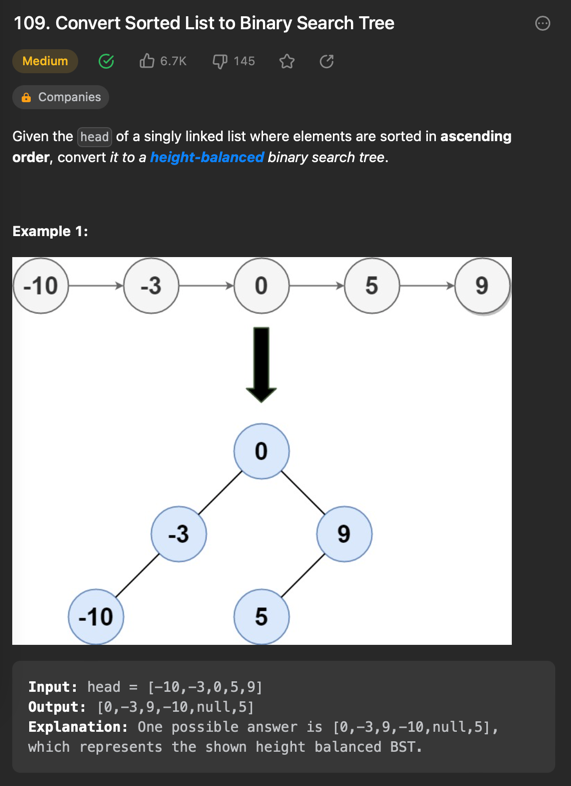
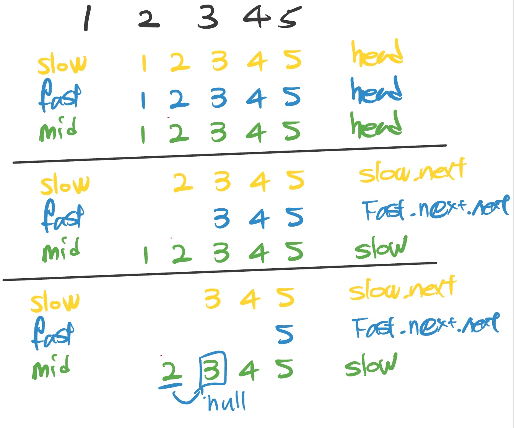

## [109. Convert Sorted List to Binary Search Tree](https://leetcode.com/problems/convert-sorted-list-to-binary-search-tree/)



### 각
- AVL 트리로 풀고싶었으나 실패(이미 만들어진 트리를 돌리다니..)
- 중간값이 가장 기준이 된다는 점에 기반하여 투포인터로 풀이

 투포인터란?
- 두개의 포인터를 이용하여 간을 비교할 때 효율적으로 사용할 수 있는 알고리즘.
- 보통 for 문 중첩 때문에 시간복잡도 O(N^2)에 걸릴 때 사용한다.


### 풀이
```java
class Solution {
    
    public TreeNode sortedListToBST(ListNode head) {
        if(head == null) return null;
        if(head.next == null) return new TreeNode(head.val);

        ListNode slow = head;
        ListNode fast = head;
        ListNode middle = slow;

        while(fast != null && fast.next != null){
            middle = slow;
            fast = fast.next.next;
            slow = slow.next;
            
        }
        TreeNode node = new TreeNode(slow.val);

        middle.next = null;
       
        node.left = sortedListToBST(head);
        node.right = sortedListToBST(slow.next);
        return node;
    }
}
```


