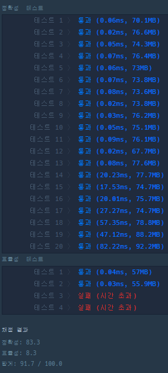
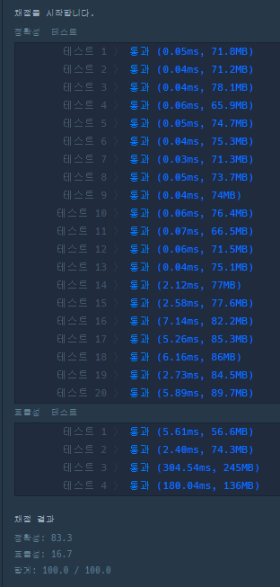

https://school.programmers.co.kr/learn/courses/30/lessons/42577

```java
class Solution {
    public boolean solution(String[] phone_book) {
        for(int i = 0; i < phone_book.length; i++){
            for(int j = i + 1; j < phone_book.length; j ++){
                if(phone_book[i].startsWith(phone_book[j])){
                    return false;
                }
                if(phone_book[j].startsWith(phone_book[i])){
                    return false;
                }
            }
        }
        return true;
    }
}

```



```java
import java.util.*;

class Solution {
    public boolean solution(String[] phone_book) {
        HashSet<String> set = new HashSet<>();
        for(int i = 0 ; i < phone_book.length ; i++){
            set.add(phone_book[i]);
        }
        for(int i = 0 ; i < phone_book.length ; i++){
            for(int j = 1 ; j < phone_book[i].length(); j++ ){
                if(set.contains(phone_book[i].substring(0,j))) {
                    return false;
                }
            }              
        } 
        return true;
    }
}
```

