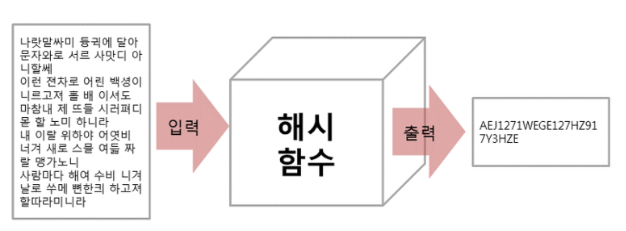
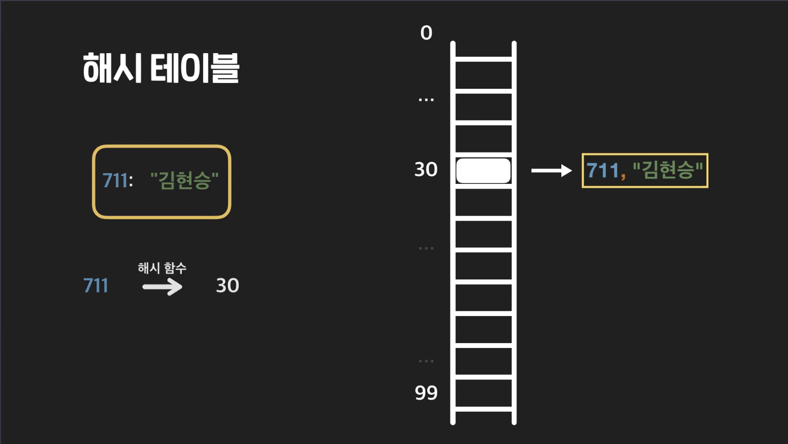
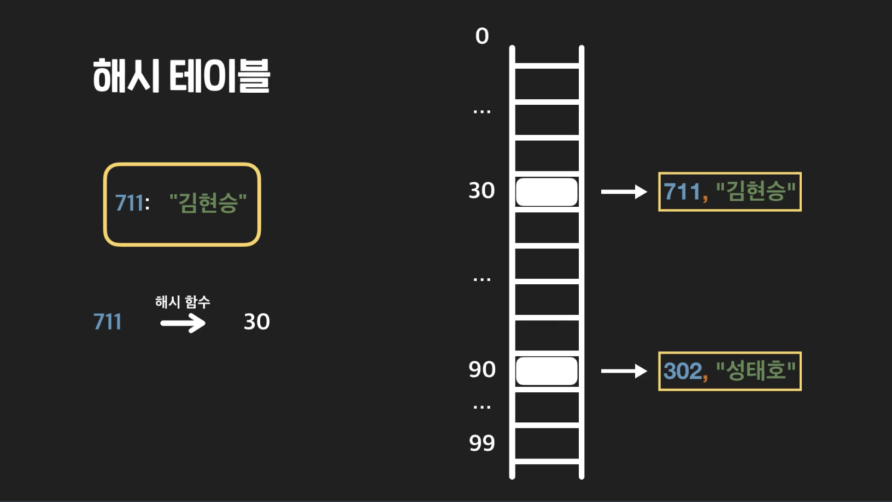
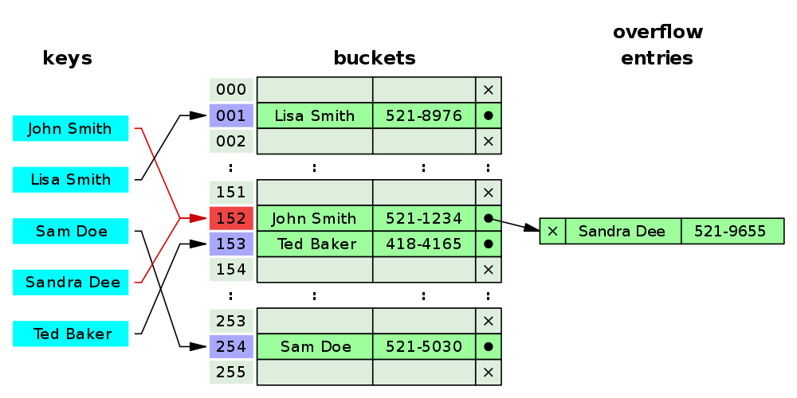
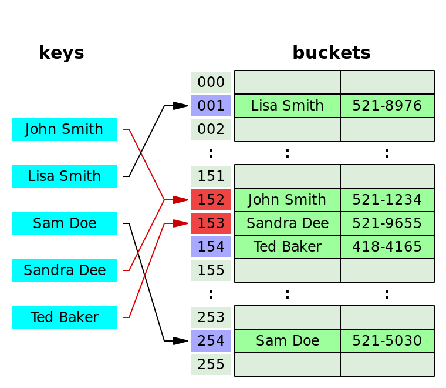
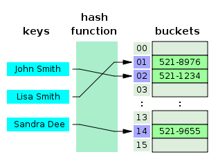

# HASH

## 개념
    해시란 단방향 암호화 기법으로 해시함수를 이용하여 임의의 크기를 가진 데이터(Key)를 고정된 길이의 비트열 데이터(Value)로 변경한다.
    (여기서 단방향 암호화 기법은 암호화는 수행하지만 복호화는 불가능한 알고리즘을 말한다.)
    키에 대한 해시값을 사용하여 값을 저장하고 키-값 쌍의 갯수에 따라 동적으로 크기가 증가하는 associate array 이다
    키에 대한 해시값을 구하는 과정을 hashing(해싱)이라고 하며 이때 사용하는 함수(알고리즘)를 해시함수 라고 한다
    이때 매핑 전 원래 데이터의 값을 키, 매핑 후 데이터의 값을 해시값, 매핑하는 과정을 해싱, 해시값+데이터색인 주소를 해시테이블이라고 한다.
    해시값 자체를 index로 사용하기 때문에 평군 시간복잡도가 O(1) 로 매우 빠르다
        → 해시 태이블의 크기에 상관없이 데이터에 빠르게 접근할 수 있다.
        → 모든 데이터를 살피지 않아도 검색과 삽입/삭제를 빠르게 실행할 수 있다.

## 해시함수
    위에 설명한 것과 같이 키에 대한 해시값을 만드는 함수
    계산이 복잡하지 않고 키값에 대해 중복없이 해시값을 고르게 만들어 내는 함수가 좋은 함수 (충돌이 일어나지 않을수록 좋다)

    특징 :
        입력값이 일부만 변경되어도 전혀 다른 해시값을 출력한다. [눈사태 효과]
        입력값 상관없이 고정된 길이의 해시값을 출력한다.
        복호화 불가능하다. [단방향 암호화 기법의 특징]
        복잡하지 않은 알고리즘으로 구현되기 때문에 상대적으로 CPU, 메모리 같은 시스템 자원을 덜 소모한다.
        같은 입력값에 대해서는 같은 출력값을 보장

    조건 :
        1. 한 해시 테이블의 해시 함수는 결정론적이어야 한다.
        -> 똑같은 key를 넣었을 때는 항상 똑같은 결과가 나와야 한다는 것이다. 942를 해시 함수에 넣을 때 어쩔 때는 5가 나오고 어쩔 때는 10이 나오고 이러면 안된다는 것이다. 942를 넣으면 항상 똑같은 결과가 나와야 한다.
        2. 결과 해시값이 치우치지 않고 고르게 나온다.
        -> 해시 함수에 101, 204, 302, 711, 942나 아무 숫자를 넣었을 때 항상 40만 나오면 안 된다는 것이다. 원하는 범위가 0~100의 자연수라면, 이 사이에 아무 두 숫자가 나올 확이 최대한 비슷해야 한다.
        3. 빨리 계산할 수 있어야 한다.
        -> 해시 테이블은 모든 연산을 할 때마다 해시 함수를 써야 되는데, 해시 함수가 비효율적이면 해시 테이블도 비효율적일 수밖에 없다.

    문제점 :
        해시함수의 특징 중 자원소모가 적어 처리속도가 빠르다고 했지만, 이건 장점이자 단점이다. 무차별 대입 공격을 받을 수 있기 때문이다.
        예) 레인보우 테이블 공격

    문제점 해결 방법 :
        솔팅 : 패스워드에 임의의 문자열 salt를 추가하여 다이제스트 생성, 레인보우테이블 공격을 무의미하게 한다. 솔트는 최소 128bit 정도 되어야 안전하다.
        키 스트레칭 : 해시를 여러 번 반복하여 시간을 늘림으로써 Brute force attack에 대비한다.
        Open Addressing : 원래라면 해시함수로 얻은 해시값에 따라서 데이터와 키값을 저장하지만 동일한 주소에 다른 데이터가 있을 경우 다른 주소도 이용할 수 있게 하는 기법이다.

    위에서 살펴본 동일한 충돌에 대해서 이번엔 체이닝 방식을 적용하지 않고 그 다음으로 비어있는 주소인 153 에 저장하는 것을 볼 수 있다. 이러한 원리로 탐색, 삽입, 삭제가 이루어지는데 다음과 같이 동작한다.
    
    삽입: 계산한 해시 값에 대한 인덱스가 이미 차있는 경우 다음 인덱스로 이동하면서 비어있는 곳에 저장한다. 이렇게 비어있는 자리를 탐색하는 것을 탐사(Probing)라고 한다.
    탐색: 계산한 해시 값에 대한 인덱스부터 검사하며 탐사를 해나가는데 이 때 “삭제” 표시가 있는 부분은 지나간다.
    삭제: 탐색을 통해 해당 값을 찾고 삭제한 뒤 “삭제” 표시를 한다.
    이러한 open addressing 방식은 3가지 방법을 통해서 해시 충돌을 처리한다.

## 해시 함수를 만드는 방법
    대표적으로 나눗셈법(Division Method)와 곱셉법(Multiplication Method)이 있다

    나눗셈법: 가장 널리 사용 중
        원소를 해시테이블의 크기로 나누어 나머지값을 테이블의 주소로 사용하는 방법
        테이블의 크기보다 원소의 갯수가 많으면 충돌이 일어난다
        가장 직관적이며 쉬운 방법임.\
        자연수 key를 해시 테이블의 크기로 나눈 나머지를 리턴하는 함수. 예를 들어 저장해야 되는 키가 40, 120, 788, 2307이고 배열 크기가 200이라고 해보자. 그럼 그냥 key를 200으로 나눠서 남는 나머지를 리턴한다는 것이다. 40을 넣으면 40, 120은 120, 788은 188, 2307은 107이 리턴된다.
    
    곱셈법:
        나누기 방법보다 살짝 더 까다롭다.
        예시) key: 200, 배열 크기: 30
        1. 0 < a < 1인 아무 값 a를 정한다. 임의로 0.666이라고 하자.
        2. 그다음에 a에 key를 곱한다. 0.666에 200을 곱하면 133.32가 되는데, 이 때 정수 부분은 버리고 소수 부분만 남긴다. 그렇게 되면 0.32가 남는다.
        3 .마지막으로 남은 소수 부분에 배열의 크기를 곱해준다. 0.32 * 30 하면 9.6이 된다. 이번엔 소수점 부분을 버리고 9만 남긴다.
    
    중간제곱(Mid-square) 함수:
        키를 제곱한 후, 적절한 크기의 중간부분을 해시값으로 사용

    접기(Folding) 함수: 
        큰 자릿수를 갖는 십진수를 키로 사용하는 경우, 몇 자리씩 일정하게 끊어서 만든 숫자들의 합을 이용해 해시값을 만든다.
        예시) 123456789012
        1. 1234 + 5678 + 9012 = 15924를 계산한 후에 해시테이블의 크기가 3이라면 15924에서 3자리 수만을 해시값으로 사용

    좋은 해시함수의 조건 :
        1. 좋은 해시함수의 조건은 Simple uniform hash 함수를 만드는 것으로, 조건은 다음과 같다.
        2. 계산된 해쉬값들은 0부터 배열의 크기-1 사이의 범위를 '동일한 확률'로 골고루 나타날 것.
        → 충돌이 일어날 확률이 적어진다.
        3. 각각의 해쉬값들은 서로 연관성을 가지지 않고 독립적으로 생성될 것.
        → 해쉬값들이 서로 연관이 있을 경우 연관성이 있으면 해당 해쉬값이 등장하는 패턴이나 순서가 존재 할 수 있고, 이는 반복적인 충돌을 일으 킬 확률이 있기 때문에 독립적으로 생성되도록 한다.

    정리
        나눗셈: key % 배열의 크기
        곱셈: 임의의 값 * key의 소수 부분 * 배열의 크기를 한 후 소숫점 버림

## 해시테이블 
해시 테이블은 (Key, Value)로 데이터를 저장하는 자료구조 중 하나로 빠르게 데이터를 검색할 수 있는 자료구조이다.\
해시 테이블이 빠른 검색속도를 제공하는 이유는 내부적으로 배열(버킷)을 사용하여 데이터를 저장하기 때문이다.\
해시 테이블은 각각의 Key값에 해시함수를 적용해 배열의 고유한 index를 생성하고, 이 index를 활용해 값을 저장하거나 검색하게 된다.\
여기서 실제 값이 저장되는 장소를 버킷 또는 슬롯이라고 한다.

예를 들어 우리가 (Key, Value)가 ("John Smith", "521-1234")인 데이터를 크기가 16인 해시 테이블에 저장한다고 하자. \
그러면 먼저 index = hash_function("John Smith") % 16 연산을 통해 index 값을 계산한다.\
그리고 array[index] = "521-1234" 로 전화번호를 저장하게 된다.\
이러한 해싱 구조로 데이터를 저장하면 Key값으로 데이터를 찾을 때 해시 함수를 1번만 수행하면 되므로 매우 빠르게 데이터를 저장/삭제/조회할 수 있다.\
해시테이블의 평균 시간복잡도는 O(1)이다.

### 해시함수 알고리즘 종류
   대표적인 해시 알고리즘의 종류로는 SHA(SHA-0, SHA-1, SHA-3, SHA-256, SHA-512, SHA-3), MD5 등이 있고 그 외에도 많은 알고리즘이 존재한다.

### MD5 ( Message-Digest algorithm 5 )
- 임의의 길이를 입력받아 128bit 길이의 해시값을 출력한다.
- 단방향 알고리즘
- 현재는 심각한 보안 문제로 인하여 MD5를 보안 관련 용도로 사용하지 않는다.
- 2008년에는 MD5의 결함을 이용해 SSL 인증서를 변조하는 것이 발견되었다.

### SHA
- 처음 SHA-0으로 정의되어 발표되었지만 바로 위험성이 발견되어 이를 개선한 SHA-1이 발표되었고, 널리 사용되었다.
- SHA-1 역시 충돌을 이용한 위험성이 발견되어 SHA-2가 발표되었다.
- SHA-2는 해시 길이에 따라 SHA-224, SHA-256, SHA-384, SHA-512 비트를 선택해서 사용한다. 해시 길이가 길수록 더 안전하다.
  ( "ABC" 문자열을 SHA-512로 변환 397118FDAC8D83AD98813C50759C85B8C47565D8268BF10DA483153B747A74743A58A90E85AA9F705CE6984FFC128DB567489817E4092D050D8A1CC596DDC119 )
  ( "ABC" 문자열을 SHA-256으로 변환 B5D4045C3F466FA91FE2CC6ABE79232A1A57CDF104F7A26E716E0A1E2789DF78 )
- 2012년에는 안정성이 높은 SHA-3이 발표되었다.

### 레인보우 테이블
- 해시함수(MD-5, SHA-1, SHA-2)를 사용하여 만들어낼 수 있는 값들을 대량으로 저장한 표이다.
- MD5가 쉽게 복호화될 수 있다는 것을 보여준 해킹비법 중 하나이다.

### 해시값으로 converting 해주는 사이트
   https://www.convertstring.com/
   MD5, SHA 말고도 BASE64, HEX, URL 인코딩 디코딩 등으로 변환해주는 온라인사이트이다.
   

참조 :
1. https://ru-magazine.tistory.com/47
2. https://baeharam.netlify.app/posts/data%20structure/hash-table