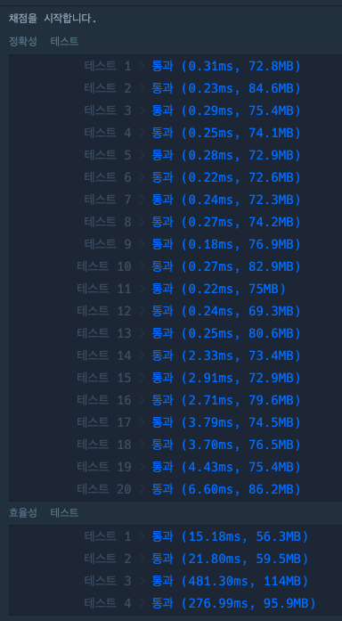

# [level 2] 전화번호 목록 - 42577

[문제 링크](https://school.programmers.co.kr/learn/courses/30/lessons/42577)

### 성능 요약

메모리: 95.9 MB, 시간: 276.99 ms

### 구분

코딩테스트 연습 > 해시

### 채점결과

 정확성: 83.3 효율성: 16.7 합계: 100.0 / 100.0

### 문제 설명

전화번호부에 적힌 전화번호 중, 한 번호가 다른 번호의 접두어인 경우가 있는지 확인하려 합니다. 
전화번호가 다음과 같을 경우, 구조대 전화번호는 영석이의 전화번호의 접두사입니다.

<ul>
<li>구조대 : 119</li>
<li>박준영 : 97 674 223</li>
<li>지영석 : 11 9552 4421</li>
</ul>

전화번호부에 적힌 전화번호를 담은 배열 phone_book 이 solution 함수의 매개변수로 주어질 때, 어떤 번호가 다른 번호의 접두어인 경우가 있으면 false를 그렇지 않으면 true를 return 하도록 solution 함수를 작성해주세요.

<h5>제한 사항</h5>

<ul>
<li>phone_book의 길이는 1 이상 1,000,000 이하입니다.

<ul>
<li>각 전화번호의 길이는 1 이상 20 이하입니다.</li>
<li>같은 전화번호가 중복해서 들어있지 않습니다.</li>
</ul></li>
</ul>

<h5>입출력 예제</h5>
<table class="table">
        <thead><tr>
<th>phone_book</th>
<th>return</th>
</tr>
</thead>
        <tbody><tr>
<td>["119", "97674223", "1195524421"]</td>
<td>false</td>
</tr>
<tr>
<td>["123","456","789"]</td>
<td>true</td>
</tr>
<tr>
<td>["12","123","1235","567","88"]</td>
<td>false</td>
</tr>
</tbody>
      </table>
<h5>입출력 예 설명</h5>

입출력 예 #1 
앞에서 설명한 예와 같습니다.

입출력 예 #2 
한 번호가 다른 번호의 접두사인 경우가 없으므로, 답은 true입니다.

입출력 예 #3 
첫 번째 전화번호, “12”가 두 번째 전화번호 “123”의 접두사입니다. 따라서 답은 false입니다.

<strong>알림</strong>

2021년 3월 4일, 테스트 케이스가 변경되었습니다. 이로 인해 이전에 통과하던 코드가 더 이상 통과하지 않을 수 있습니다.

> 출처: 프로그래머스 코딩 테스트 연습, https://programmers.co.kr/learn/challenges

