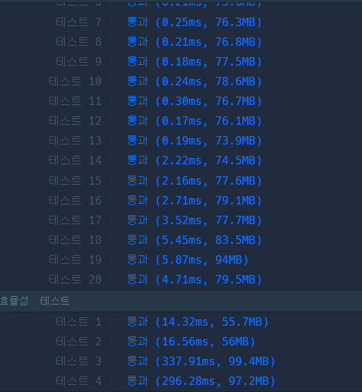

```java
import org.junit.Test;
import static org.junit.Assert.*;

public class SolutionTest {
    @Test
    public void testSolution() {
        Solution solution = new Solution();

        // Test case 1
        String[] phone_book1 = {"119", "97674223", "1195524421"};
        assertFalse(solution.solution(phone_book1));

        // Test case 2
        String[] phone_book2 = {"123", "456", "789"};
        assertTrue(solution.solution(phone_book2));

        // Test case 3
        String[] phone_book3 = {"12", "123", "1235", "567", "88"};
        assertFalse(solution.solution(phone_book3));
    }
}

class Solution {
    public boolean solution(String[] phone_book) {
        // 1. 모든 전화번호 쌍을 검사
        for (int i = 0; i < phone_book.length; i++) {
            for (int j = 0; j < phone_book.length; j++) {
                // 같은 번호는 비교하지 X
                if (i != j) {
                    // 2. 한 번호가 다른 번호의 접두사인지 확인.
                    if (phone_book[j].startsWith(phone_book[i])) {
                        // 3. 접두사를 찾았다면 false를 반환.
                        return false;
                    }
                }
            }
        }

        // 4. 접두사가 없다면 true를 반환
        return true;
    }
}
```

```java
import java.util.Arrays;

class Solution {
    public boolean solution(String[] phone_book) {
        // 전화번호부를 정렬합니다.
        Arrays.sort(phone_book);

        // 정렬된 전화번호부를 순회하며 접두사를 확인합니다.
        for (int i = 0; i < phone_book.length - 1; i++) {
            if (phone_book[i + 1].startsWith(phone_book[i])) {
                // 접두사를 찾았다면 false를 반환합니다.
                return false;
            }
        }

        // 접두사가 없다면 true를 반환합니다.
        return true;
    }
}
```



```java
import org.junit.Test;
import 신원호.Solution;

import static org.junit.Assert.*;

import java.util.Arrays;

public class SolutionTest {
    @Test
    public void testSolution() {
        Solution solution = new Solution();

        // Test case 1
        String[] phone_book1 = {"119", "97674223", "1195524421"};
        System.out.println("Test case 1: " + Arrays.toString(phone_book1));
        boolean result1 = solution.solution(phone_book1);
        System.out.println("Result 1: " + result1);
        assertFalse(result1);

        // Test case 2
        String[] phone_book2 = {"123", "456", "789"};
        System.out.println("Test case 2: " + Arrays.toString(phone_book2));
        boolean result2 = solution.solution(phone_book2);
        System.out.println("Result 2: " + result2);
        assertTrue(result2);

        // Test case 3
        String[] phone_book3 = {"12", "123", "1235", "567", "88"};
        System.out.println("Test case 3: " + Arrays.toString(phone_book3));
        boolean result3 = solution.solution(phone_book3);
        System.out.println("Result 3: " + result3);
        assertFalse(result3);
    }
}
```