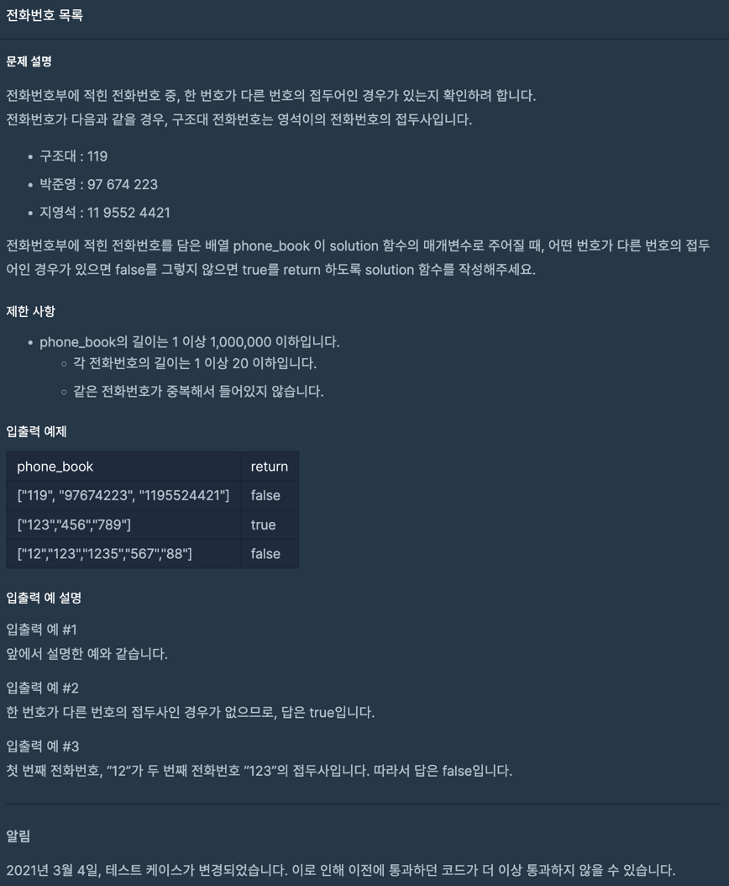
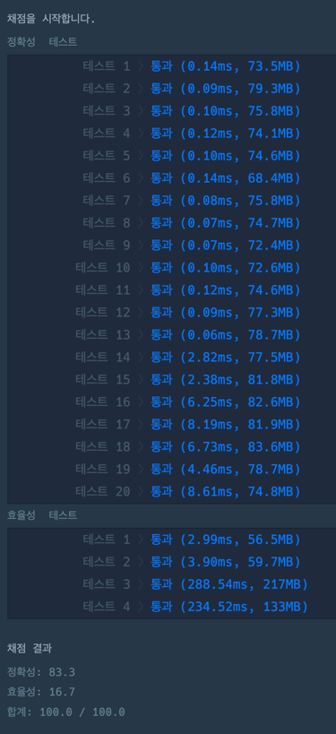
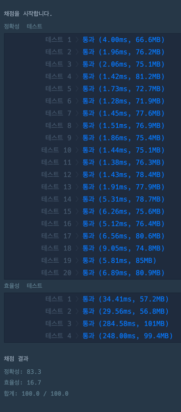

> https://school.programmers.co.kr/learn/courses/30/lessons/42577

~~~java
import java.util.*;
import java.util.stream.Collectors;

class Solution {
    /**
     * 최종
     *
     * 중복이 불가라고 해서 set 사용
     *
     * @param phone_book
     * @return
     */
    public boolean solution(String[] phone_book) {
        Set<String> set = new HashSet<>();

        for (String phone : phone_book) {
            set.add(phone);
        }

        for (String phone : phone_book) {
            final var length = phone.length();

            for (int i = 0; i < length; i++) {
                if (set.contains(phone.substring(0, i))) return false;
            }
        }

        return true;
    }
}
~~~

~~~java
import java.util.*;
import java.util.stream.Collectors;

class Solution {

    /**
     * 첫 정답
     *
     * 정렬 후 다음 것만 비교
     * (정렬시 문자열이라 앞 숫자가 작은것부터 정렬됨)
     * ex)
     * {"119", "97674223", "1195524421"} -> 119, 1195524421, 97674223
     *
     * @param phone_book
     * @return
     */
    public boolean solution(String[] phone_book) {
        List<String> sorted = Arrays.stream(phone_book)
                .sorted()
                .collect(Collectors.toList());

        final var size = sorted.size();

        for (int currentIndex = 0, i = 1; i < size; i++) {
            String current = sorted.get(currentIndex);
            String next = sorted.get(i);

            if (next.startsWith(current)) return false;

            currentIndex++;
        }

        return true;
    }
}
~~~