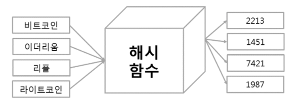

# 해시
> 해시는 다양한 길이를 가진 데이터를 특정한 길이로 매핑한 값이며 해시 코드, 해시 함수 값 등의 줄임말이다. <br>
> 데이터를 해시로 매핑할 때 사용되는 함수는 해시 함수라고 불리며, 함수를 통해 매핑된 해시는 여러가지 특징을 가지게 된다. <br> 
> 그 중 눈여겨 볼만한 특징은 “특정 패턴의 배열을 가진 인덱스나 데이터 값을 이용해 보관 및 서칭이 가능하다는 것” 입니다. <br> 

---

## 개요


- ```키``` : 매핑 전 원래 데이터의 값
- ```해시 값``` : 매핑 후 데이터의 값
- ```해시 테이블``` : 해시값 + 데이터 색인 주소
- ```해싱``` : 매핑하는 과정

---

### 사용예시
1. 비밀번호저장<br>
 <br><br>

2. 복제문서인지 판별 <br>
 <br><br>

3. 검색 <br>
 <br><br>

---

## 해시함수
> 해시 함수는 고유한 인덱스를 만든다. 만약 인덱스가 중복된다면, **충돌** 로 이어지게 된다. 따라서 적절한 해시 알고리즘을 구현하는 것이 중요하다.

- ```Division Method``` : 숫자 Key를 테이블의 크기로 나누어 나온 나머지를 인덱스로 사용한다. ( index = Key % 테이블 크기 ) 이때 테이블의 크기를 소수(Prime Number)로 정하고 2의 제곱수와 먼 값을 사용하는 것이 효과가 좋다. 예를 들어 Key 값이 23일 때 테이블 사이즈가 7이라면 index는 2다.
- ```Digit Folding``` : Key의 문자열을 ASCII 코드로 바꾸고 그 값을 합해 테이블 내의 주소로 사용하는 방법이다. 위 예시와 비슷한 상황에서 사용될 수 있다. "Ryan" 같은 문자열을 R->82 + y->121 +  a->97  + n->110 = 410을 index로 사용하면 된다. 만약 이때 index가 테이블의 크기를 넘어간다면 Division Method를 적용할 수 있을 것이다.
- ```Multiplication Method``` : 숫자로 된 Key 값 K와 0과1 사이의 실수 A, 보통 2의 제곱수인 m을 사용하여 다음과 같이 계산한 값을 index로 사용한다. index = (K*A mod 1)*m

---

## 해시테이블 
> 해시테이블은 해시함수를 사용하여 키를 해시값으로 매핑하고, 이 해시값을 색인(인덱스) 또는 주소삼아 데이터를 key와 함께 저장하는 자료구조이다. (key-value)


- 평균 O(1)로 value를 검색 가능
- key 값을 해시함수를 사용하여 변환한 값을 색인으로 삼는다
- 해시함수를 사용해 Key 값을 변환하는 과정을 해싱 이라고 한다.

---

## 해시 충돌
> 해시 충돌은 인덱스가 중복되는 경우에 발생한다

- 하나의 원 데이터는 하나의 해시값만 가지지만, 하나의 해시값을 만들어낼 수 있는 원본 데이터는 매우 많다. 때문에 해시값만 가지고는 아무리 용을 써도 이미 뭉개진 원문을 복원해내는 것은 불가능하다. 따라서 비밀번호, 전자서명, 전자투표, 전자상거래와 같은 민감한 입력의 무결성을 검증할 때 사용된다. (단방향)
- 해시 충돌은 데이터 무결성과 직접적인 연관이 있기 때문에 보안 분야에서 매우 민감한 문제에 해당한다
- 현재까지 개발된 해시함수는 거의 모두 충돌 문제가 확인되었다, SHA-1, SHA-256, SHA-512 는 해시 충돌의 가능성이 이론적으로 제시되었다. (2014년 기준으로 해시충돌 문제가 없는건 SHA-3)

---

### 해시 충돌 예시
1. 0 ~ 10000 까지 데이터를 담을 수 있는 리스트를 생성하고, 'youngmin'이란 단어를 해싱하여 '1234'란 색인이 생성되면 '1234'에 'yongmin'을 저장한다
2. 해시 함수는 언제나 동일한 해시 값을 반환하기 때문에 'youngmin'을 입력하면 항상 '1234' 색인이 나오므로 굳이 정렬하지 않고도 찾을 수 있다.
3. 나중에 'eric' 단어를 해싱했더니 '1234'란 색인이 나온다면, 'youngmin'과 동일한 색인이 나와 문제가 발생한다.

---

### 해시 충돌 해결 방법
#### 1. 분리연결법

- 한 버킷당 들어갈 수 있는 엔트리의 수에 제한을 두지 않는 방법으로 모든 자료를 해시 테이블에 담는다
- 해당 버킷에 데이터가 있다면 체인처럼 노드를 추가하여, 다음 노드를 가리키는 방식으로 구현한다
- Linked List를 이용 하는 방식
- 동일 index로 충돌하면 linked list에 노드를 추가하여 값을 추가한다
- 데이터 추출은 key에 대한 index를 구한 후, index가 가리키고 있는 linked list를 선형 검색하여 해당 key에 대한 데이터가 있는지를 검색하여 리턴한다.
- key 삭제 역시, key에 대한 index가 가리키는 linked list에서 그 노드를 삭제한다
- [단점] 메모리 문제를 야기할 수 있다.

#### 2. 개방 주소법
- 분리 연결법과 달리 한 버킷당 들어갈 수 있는 엔트리가 하나뿐인 해시 테이블
- 해시테이블 array의 빈공간을 사용하는 방법이다
- [단점] 삭제가 어렵다 (삭제시 충돌에 의해 뒤로 저장된 데이터는 검색이 안될 수 있다)

#### 3. 리스트 크기 재배열
- 충돌을 해결한다 해도 성능 저하는 막을 수 없다
- 수용률이 일정량을 넘어가게 되는 경우에, 아예 리스트 자체의 크기를 키운 뒤에 재배열을 하는 방법을 사용한다
- 이 과정 자체가 비용이 많이 들기 때문에, 실시간 처리 환경에서는 무리가 있다 

#### 4. 해시 테이블 확장 방식
- 큰 리스트를 하나 더 만들어서 적당한 타이밍에 몇 개씩 점진적으로 옮기다가 다 옮기면 기존의 테이블을 없애 확장하는 방식
- 메모리를 훨씬 더 많이 사용하게 된다

#### 5. Consistent Hashing - 해시의 비트수를 늘리는 방법
- 해시의 비트수를 늘리는 방법
- 항목 수가 적을 때에는 짧은 해시와 작은 저장공간을 사용하다가 충돌이 잦아지면 비트수를 1비트 늘리고 저장 공간도 2배로 늘린다
- 그리고 항목을 점진적으로 확장된 공간으로 이전하게 함으로써 충돌을 줄일 수 있다
- 분산 데이터 베이스에서 데이터의 일관성을 유지하기 위해 사용되고 있다.

#### 6. 해시 함수를 이용한 해시 충돌 해결 방법

- 해시테이블의 크기가 m이라면, 좋은 해시함수는 임의의 키 값을 임의의 해시 값에 매핑할 확률이 1/m 이 될 것이다.
- 즉, 충돌나지 않고 해시 값을 고르게 만들어내는 해시 함수가 좋은 해시함수이다.

---

## 해시 알고리즘 종류
> 유명한 해시 알고리즘으로는 MD와 SHA 등이 있다.

## 1. MD5
- 임의의 길이의 값을 입력 받아서 128 비트 길이의 해시값을 출력하는 알고리즘
- MD5는 단방향 암호화 이기 때문에 출력값에서 입력값을 복원하는 것은 할 수가 없다.
- 서로 다른 입력 값에서 같은 입력 출력값이 나올 확률은 극히 낮다. (충돌 가능성 있음)
- 패스워드 암호화에 많이 사용
- 현재는 MD5 알고리즘을 보안 관련 용도로 쓰는 것을 권장하지 않는다.

---

## 2. SHA
- SHA-0, SHA-1은 160 비트의 해시값을 사용한다.
- SHA-0과 SHA-1은 충돌 위험성이 발견되어 차세대 버전으로 넘어갔다.
- 기존 SHA 를 개선하여 SHA-2버전이 나왔고, 해시 길이에 따라 SHA-255, SHA-256, SHA-384, SHA-512 비트를 선택해서 사용할수 있다.
- 해시가 길수록 더 안전하다
- 2012년 안정성이 더 높은 방식으로 설계된 SHA-3 가 정식 발표되었다