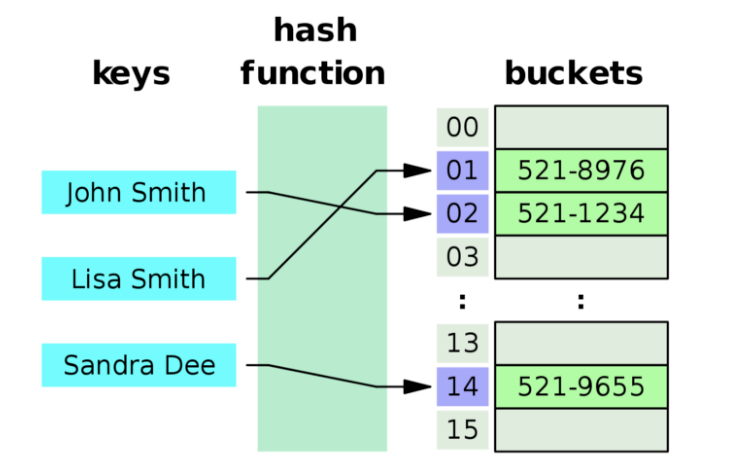

# 해쉬
  
## 해쉬란?
해쉬 알고리즘이란 여러가지 길이의 데이터를 고정 길이의 데이터로 전환시키는 알고리즘을 말한다.  
이러한 알고리즘을 수행하는 함수를 해쉬 함수(hash function)라고 부른다.  

자료구조에서 해쉬라 함은 일반적으로 해쉬를 이용해서 구현하는 해쉬 테이블 자료구조를 뜻한다.  
해쉬 테이블은 특정한 Key(데이터)를 해쉬함수로 변형시킨 뒤 해쉬함수의 결과물에 해당하는 키에 Value(데이터)를 저장시키는 자료구조이다.  
테이블 말고도 맵, 혹은 딕셔너리 라고 하기도 한다.  

## 해쉬 함수
해쉬 함수는 여러가지 길이의 데이터를 고정 길이의 데이터로 변환시키는 함수이다.  
가장 간단한 해쉬 함수는 입력 데이터를 해쉬 테이블의 길이로 나눈 나머지를 반환하는 것이다.  
이 때 테이블의 크기를 소수(1과 자기 자신으로만 나누어 떨어지는 수)면서 2의 제곱수와 먼 값으로 쓰는 것이 확률상 효율적이라고 한다.  
이런 식으로 수학적 기법을 사용하여 해쉬 충돌을 최대한 방지한다.  

## 해쉬 충돌
해쉬는 가변 길이의 데이터를 고정 길이로 만드는 알고리즘 특성상 서로 다른 데이터가 같은 해쉬값을 갖게되는 경우가 있다.  
이런 경우를 해쉬 충돌이라고 부른다.  
예) 테이블 길이가 2일 경우 1%2=1, 3%2=1 로 1과 3이 같은 해쉬값을 갖는다.  

해쉬 충돌을 방지하기 위한 해쉬 충돌 알고리즘 또한 존재한다.  
대표적인 해쉬 충돌 알고리즘으로 아래와 같은 알고리즘들이 있다.  
* 분리 연결법(Separate Chaining)
  *   
  * 분리 연결법은 해쉬 테이블에 데이터를 저장할 때 링크드리스트 등의 자료구조를 이용해서 충돌이 발생했을 경우 중복되는 데이터를 연결된 자료구조에 추가로 저장하는 방식이다.  
  * 분리 연결법은 테이블의 크기를 그대로 유지하며 자료를 저장할 수 있고 구현 또한 간단하다는 장점이 있지만 데이터를 탐색하는데 들어가는 비용이 커질 수 있다는 단점도 있다(충돌이 많이 일어날수록 느려진다).

* 개방 주소법
  * 개방 주소법은 해시 충돌이 일어났을 경우 테이블의 다른 빈 공간을 찾아 이용하는 방법이다.
  * 구현법으로는 아래와 같은 세 가지 방법이 있다.
    1. Linear Probing : 현재의 버킷 index로부터 고정폭만큼 이동하여 차례대로 검색해 비어 있는 버킷에 데이터를 저장한다.
    2. Quadratic Probing : 해시의 저장순서 폭을 제곱으로 저장하는 방식이다. 예를 들어 처음 충돌이 발생한 경우 1만큼 이동하고, 그다음 충돌이 발생하면 2^2, 3^2 칸 씩 옮기는 방식이다.
    3. Double Hasing Probing : 해시된 값을 한 번 더 해싱하여 해시의 규칙성을 없애버리는 방식. 해시된 값을 한번 더 해싱하여 새로운 주소를 할당하므로 기존 방식보다 더 많은 연산을 하게 된다.

## 해쉬 테이블의 장단점
해쉬 테이블은 키 값으로 바로 테이블을 참조할 수 있는 구조상 일반적으로 데이터를 탐색할 때 O(1)의 복잡도를 가진다.  
따라서 많은 반복을 통해 데이터를 탐색해야할 때 일단 모든 데이터를 해쉬 테이블에 등록하기만 하면 이후에는 데이터를 한 번에 찾아낼 수 있다.  
데이터를 등록하는 데에 n번을 순회해야 하므로 일반적으로는 O(n)의 복잡도를 가지는 알고리즘을 만들 수 있다.  

반대로 해쉬 테이블은 데이터를 조회할 때 해쉬 함수 계산을 수행하기 때문에  
탐색회수가 같은 알고리즘이라면 속도가 더 느려질 수 있다.  

## 알고리즘에서 해쉬 테이블의 활용
* 2, 3중 for문을 이용해서 전체 데이터를 탐색해야 할 때 해쉬 테이블에 모든 데이터를 저장한 뒤 키값으로 검색하는 방법으로 탐색회수를 줄일 수 있는 경우가 있다.
* 중복 검사가 필요할 때 해쉬 테이블에 데이터를 key값으로 넣고 value에 임의의 값을 넣은 뒤 key값에 데이터가 들어있는지 검사하는 식으로 중복 검사를 수행할 수 있다.

