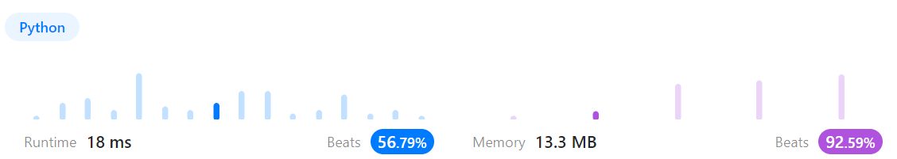
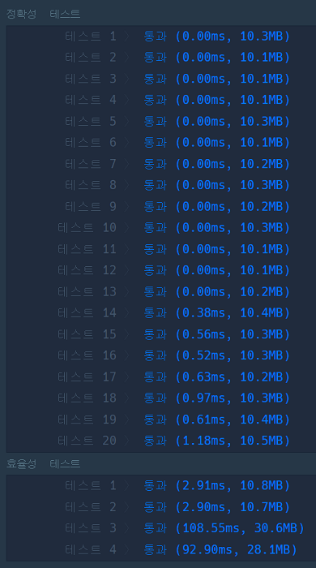
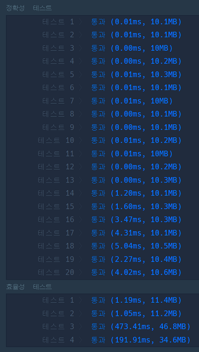

# 문제풀이
## 814. Binary Tree Pruning

### Discription  
요약) 트리가 주어지면 해당 트리의 노드가 모두 0인 서브트리를 제거한 트리를 반환하라  
https://leetcode.com/problems/binary-tree-pruning/description/  

### Solution

```python
# Definition for a binary tree node.
# class TreeNode(object):
#     def __init__(self, val=0, left=None, right=None):
#         self.val = val
#         self.left = left
#         self.right = right
class Solution(object):
    def pruneTree(self, root):
        """
        :type root: Optional[TreeNode]
        :rtype: Optional[TreeNode]
        """
        return self.dfs(root)

    def dfs(self, node):
        if not node:
            return None

        node.left = self.dfs(node.left)
        node.right = self.dfs(node.right)

        if node.left or node.right or node.val is 1:
            return node

        return None
```
  
dfs 순회를 돌면서 내가 leaf노드이고 0일 때 null을 반환한다(루트와 연결을 끊는다)  
후위순회로 실행시켜야 순서가 맞는다  
if조건에서 한번에 검사하는 게 조금 빨랐다  

## 전화번호 목록

### 문제 설명
요약)  
전화번호부에 적힌 전화번호를 담은 배열 phone_book 이 solution 함수의 매개변수로 주어질 때,  
어떤 번호가 다른 번호의 접두어인 경우가 있으면 false를 그렇지 않으면 true를 return 하도록 solution 함수를 작성해주세요.  
https://school.programmers.co.kr/learn/courses/30/lessons/42577  

### Solution

```python
import re

def solution(phone_book):
    length = len(phone_book)
    
    for i in range(length):
        pattern = re.compile("^" + phone_book[i])
        for j in range(length):
            if phone_book[i] == phone_book[j]:
                continue
            if pattern.match(phone_book[j]):
                return False
    
    return True
```
전체 순회하면서 regexp로 검사  
정답은 맞지만 당연히 느려서 통과 못했다  

```python
import re

def solution(phone_book):
    phone_book.sort()
    length = len(phone_book)
    
    for i in range(length-1):
        pattern = re.compile("^" + phone_book[i])
        if pattern.match(phone_book[i+1]):
            return False
    
    return True
```
문자열 정렬을 실행하면 앞자리가 같고 짧은게 바로 앞에 온다.  
n번 순회하면서 바로 뒤에것과 비교해주면 된다는 점에서 착안했다.  
20번 케이스의 속도가 2550ms -> 90ms로 개선됐지만 속도 테스트에서 통과하지 못했다.  
regexp 성능자체가 나쁜걸지도?  

```python
def solution(phone_book):
    phone_book.sort()
    length = len(phone_book)
    
    for i in range(length-1):
        now = phone_book[i]
        next = phone_book[i+1]
        if now == next[:len(now)]:
            return False
    
    return True
```
  
아예 문자열 연산하니까 통과했다.  
중복이 없으니까 이렇게 계산 가능한데 중복이 있으면 불가능할 듯.  

```python
def solution(phone_book):
    hashmap = {}
    for phone in phone_book:
        hashmap[phone] = 1
    
    for phone in phone_book:
        prefix = ''
        for n in phone:
            prefix += n
            # dict에 in을 쓰면 키가 있는지 찾는다
            # []로 조회시 키가 없으면 익셉션 발생
            if prefix in hashmap and prefix != phone:
                return False
    
    return True
```
  
해쉬맵 이용한 풀이  
해쉬맵에 모든 번호를 미리 넣어두고  
현재 번호에서 한글자씩 가져오면서 해당하는 번호가 있는지 찾는다  
내 번호랑 똑같을 경우 무조건 True이니 조건문 추가(prefix != phone)  
모든 문자열의 길이가 같을 경우 O(n^2) 나올거 같은데 왜 빠른지 모르겠다  

```python
def solution(phone_book):
    length = len(phone_book)
    
    for i in range(length):
        for j in range(length):
            i_len = len(phone_book[i])
            if phone_book[i] == phone_book[j][:i_len] and phone_book[i] != phone_book[j]:
                return False
    
    return True
```
이거랑 똑같다고 생각하는데 이건 왜 안되는지 모르겠다.  
