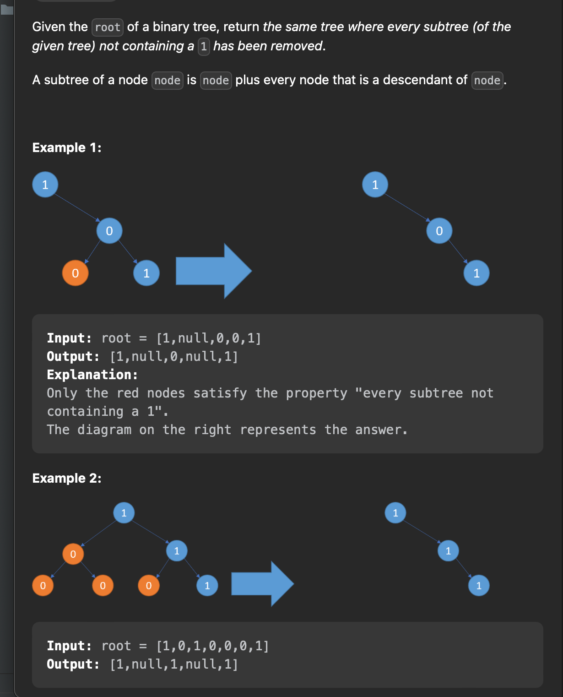
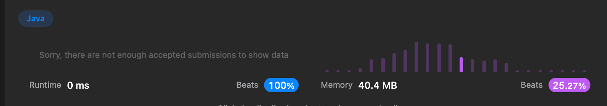

## [문제](https://leetcode.com/problems/binary-tree-pruning/)




### 풀이법
- 깊이우선 탐색으로 풀어보자
- 해결 시 어려웠던 점 
  - 루트노드도 바꿔야했을때 당황함.  [0] 

### 풀이
```java
class Solution {
    public TreeNode pruneTree(TreeNode root) {
        if(root == null) return null;
        boolean bool = dfs(root);
        if (bool == false){
            return null;
        }
        return root;
    }

    public boolean dfs(TreeNode root) {
        if(root == null) return false;
        boolean leftValue = dfs(root.left);
        boolean rightValue = dfs(root.right);

        if(!leftValue){
            root.left = null;
        }
        if(!rightValue){
            root.right = null;
        }

        if(root.val == 0 && !leftValue && !rightValue) {
            return false;
        }

        return true;
    }

}
```





- Thiamin 20 mg
- Riboflavin 20 mg
- Niacin 140mg
- Vitamin B6 20mg
- Folate 600 mcg DFE
- Vitamin B12  400mcg
- Biotin 400mcg
- Pantothenic Acid 150mg
- Choline 30mg
- Benfotiamine 20mg